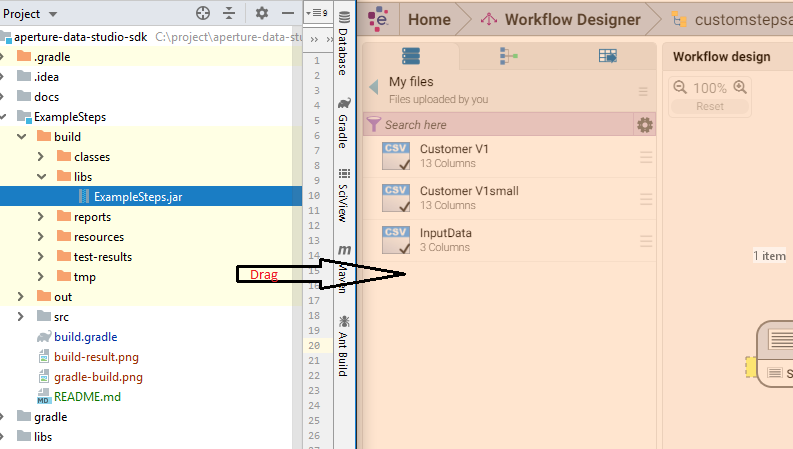
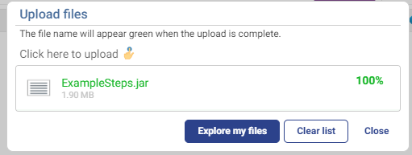
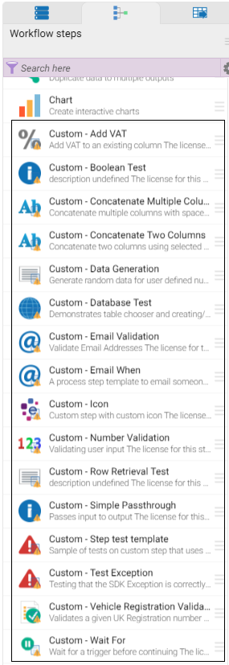

# ExampleSteps

This project is to showcase SDK capabilities and SDK Test framework capabilities.

## Build Configuration

This demo project rely on the [Gradle shadow plugin](https://github.com/johnrengelman/shadow) to pack all of the dependencies 
into one a single `jar`. This way our sample code can easily integrate with 3rd party libraries, such as Apache Async HTTP 
client used in [RestServiceSampleStep.java](src/main/java/com/experian/aperture/datastudio/sdk/step/examples/testframework/RestServiceSampleStep.java).

Gradle Shadow Plugin [documentation](https://imperceptiblethoughts.com/shadow/)

### Deployment

1. Run `gradle build` either from the command line or from Intellij:

   
   
1. The output of the build is located at `build/libs/ExampleSteps.jar`.

   
   
1. Drag and drop the jar into Aperture Data Studio UI. 

   
   
1. Make sure that the upload is successful. If the upload failed, most likely you already have jar with the same name 
   uploaded. Stop Aperture Data Studio and delete the respective jar from `addons` folder
   
   
   
1. Once the jar is successfully uploaded, the _example steps_ will be listed in the left pane:

    
    
**Note**: the [RestServiceSampleStep.java](src/main/java/com/experian/aperture/datastudio/sdk/step/examples/testframework/RestServiceSampleStep.java)
depends on the specific input data that contains color index. You could extract the sample data from test resources 
folder:

1. The sample data is available at [InputData.csv](src/test/resources/InputData.csv)
1. Drag and drop this data into your Aperture Data Studio UI.
1. Link it with the custom step.

    

## Testing 

[Sample usage of SDK Test Framework](src/test/java/com/experian/aperture/datastudio/sdk/step/examples/)

### Integration with MockServer

Please refer to [StepComponentTest](src/test/java/com/experian/aperture/datastudio/sdk/step/examples/testframework/StepComponentTest.java) 
for integration of SDK Test Framework with [MockServer](http://www.mock-server.com/) to simulate a real Http request and response.

