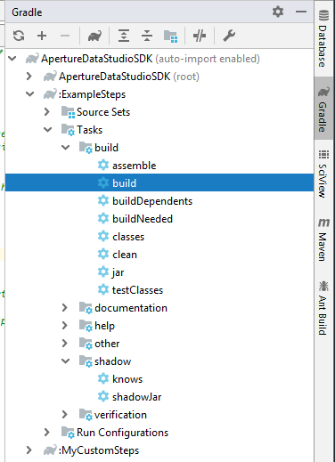
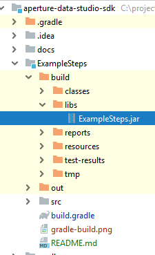
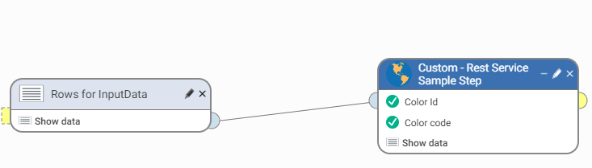

# ExampleSteps

This project provides instructions on how to generate an `ExampleSteps jar`, upload it into Data Studio, and test your custom steps. 

## Build Configuration

This demo project relies on the [Gradle Shadow Plugin](https://github.com/johnrengelman/shadow) to pack all of the dependencies 
into a single `jar`. This way, our sample code can be used to easily integrate with third party libraries, such as the Apache HTTPAsyncClient used in [`RestServiceSampleStep.java`](src/main/java/com/experian/aperture/datastudio/sdk/step/examples/testframework/RestServiceSampleStep.java).

For more details about the Gradle Shadow Plugin, refer to the [user documentation](https://imperceptiblethoughts.com/shadow/).

### Deployment

1. Run `gradle build` either from the command line or from IntelliJ IDEA:

    
   
2. The output of the build is located at `build/libs/ExampleSteps.jar`:

    
   
3. Drag and drop the `jar` into Data Studio UI. 

    
   
4. Make sure that the upload is successful.
   
    

    **Note**: if the upload fails, the most likely reason is that you already have a `jar` with the same name uploaded. To fix the issue, stop Data Studio and delete the existing `jar` from the Data Studio installation directory, `addons` folder. Afterwards, launch Data Studio again and drag and drop your new `jar`. 
   
5. Once the `jar` is successfully uploaded, the _example steps_ will be listed in the left-hand side pane:

    
    
**Note**: [`RestServiceSampleStep.java`](src/main/java/com/experian/aperture/datastudio/sdk/step/examples/testframework/RestServiceSampleStep.java) depends on the specific input data that contains color index. You can extract the sample data from the test resources folder:

1. The sample data is available at [InputData.csv](src/test/resources/InputData.csv)
2. Drag and drop this data into your Data Studio UI.
3. Link it with the custom step:

    

## Testing 

To test your custom steps, please refer to the [sample usage of SDK Test Framework](src/test/java/com/experian/aperture/datastudio/sdk/step/examples/).

### Integration with MockServer

Refer to [`StepComponentTest`](src/test/java/com/experian/aperture/datastudio/sdk/step/examples/testframework/StepComponentTest.java) to integrate the SDK Test Framework with [MockServer](http://www.mock-server.com/). This allows you to simulate a real HTTP request-response exchange.

