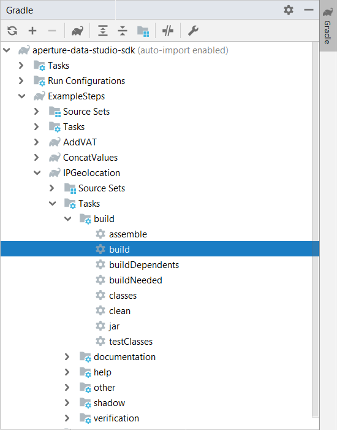
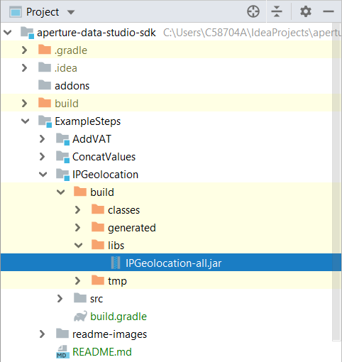
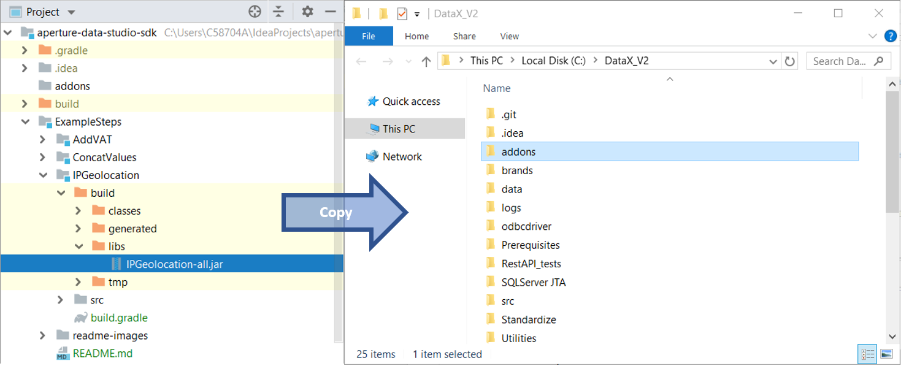
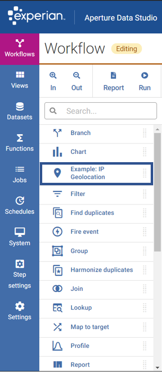
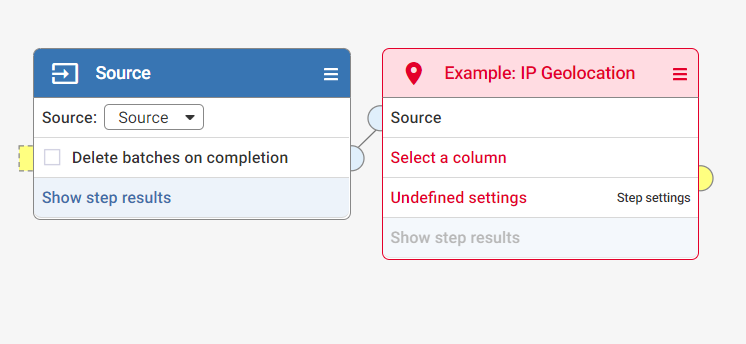
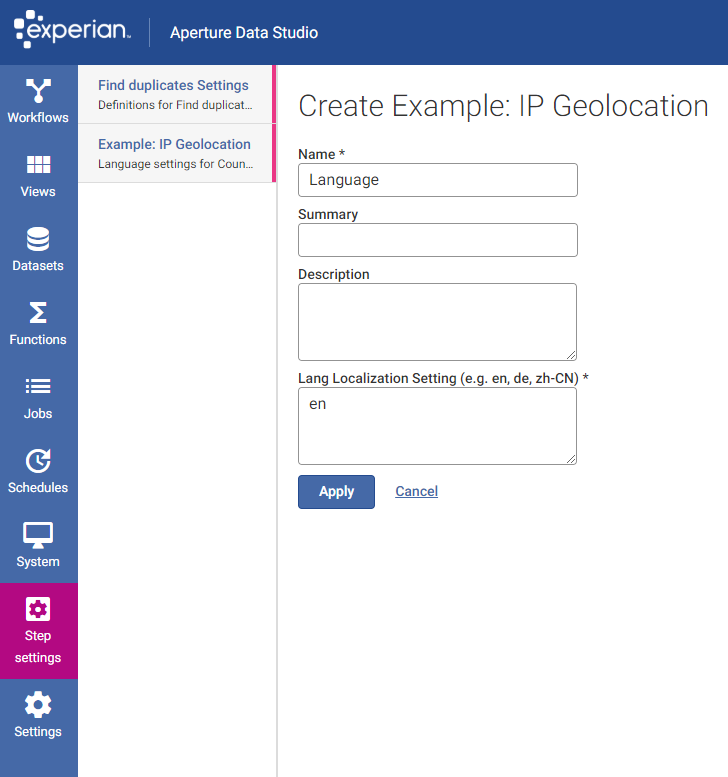

# ExampleSteps

This project provides instructions on how to generate an `ExampleStep jar`, upload it into Data Studio, and deploy your custom step. 

Example custom steps provided are: 
- AddVAT
- ConcatValues
- IPGeolocation

## Build Configuration

This demo project relies on the [Gradle Shadow Plugin](https://github.com/johnrengelman/shadow) to pack all of the dependencies 
into a single `jar`. This way, our sample code can be used to easily integrate with third party libraries, such as the Apache Commons Lang used in [`IPGeolocation.java`](IPGeolocation/src/main/java/com/experian/aperture/datastudio/sdk/step/examples/IPGeolocation.java).

For more details about the Gradle Shadow Plugin, refer to the [user documentation](https://imperceptiblethoughts.com/shadow/).

### Deployment

1. Run `gradle build` either from the command line or from IntelliJ IDEA:

    
   
2. The output of the build is located at `build/libs/IPGeolocation-all.jar`:

    
   
3. Copy and paste the `jar` into the Data Studio addons folder. 

    
   
4. Make sure that the upload is successful.

    **Note**: if the upload fails, the most likely reason is that you already have a `jar` with the same name uploaded. To fix the issue, stop Data Studio and delete the existing `jar` from the Data Studio installation directory, `addons` folder. Afterwards, launch Data Studio again and drag and drop your new `jar`. 
   
5. Once the `jar` is successfully uploaded, the _example steps_ will be listed in the left-hand side pane:

    

### Linking the Example Step to a Source

[IPGeolocation](IPGeolocation/src/main/java/com/experian/aperture/datastudio/sdk/step/examples/IPGeolocation.java) depends on specific input data that contains IPv4 addresses. You can extract the sample data from the test resources folder:

1. The sample data is available at [sample-ip.csv](IPGeolocation/src/test/resources/sample-ip.csv)
2. Add the sample data as a source under the Datasets tab. 
3. Select this data as source in the Data Studio UI.
4. Link it with the custom step:

    
5. Execute/Run the workflow or click on `Show step results`.

## AddVAT Example Step

## ConcatValues Example Step

## IPGeolocation Example Step

The [IPGeolocation](IPGeolocation/src/main/java/com/experian/aperture/datastudio/sdk/step/examples/IPGeolocation.java) example step takes a list of IPv4 addresses as an input and maps them to their respective countries of origin. 

This example step relies on [ip-api](https://ip-api.com/docs), an API endpoint that identifies the country of origin (and other location specific data) based on a provided IP address. In this example, the response is returned in JSON format. 

The input is taken from a single column from an input node and the output is published to a single column in the output node. As the example step is large, the main class is ['IPGeolocation.java'](IPGeolocation/src/main/java/com/experian/aperture/datastudio/sdk/step/examples/IPGeolocation.java) which contains the *metadata* and *configuration*. The *processor* is housed in a separate class ([`IPGeolocationProcessor.java`](IPGeolocation/src/main/java/com/experian/aperture/datastudio/sdk/step/examples/IPGeolocationProcessor.java)) for better readability. 

The [IPGeolocation](IPGeolocation/src/main/java/com/experian/aperture/datastudio/sdk/step/examples/IPGeolocation.java) example step demonstrates the following features of the Aperture Data Studio SDK: 
- HTTP requests (using the SDK HTTP Libraries/Helper Classes)
- Caching (using SDK Cache)
- Throttling (using Java Semaphore)
- Step Settings (retrieving lang settings from the UI for query)
- Concurrent asynchronous requests (using Java CompletableFuture)

#### HTTP Requests
The HTTP requests are made using the SDK HTTP libraries/helper classes (i.e. `WebHttpClient`, `WebHttpRequest`, `WebHttpResponse`). First, an HTTP web client (`WebHttpClient`) is set up, and a request (`WebHttpRequest`) is sent through the client using the `sendAsync()` method. This returns a `WebHttpResponse` which contains the location data of the IP address in JSON format. 

#### Cache
When executing the step, it first checks if there is any data stored in the cache. If there is a valid cache, the output is populated from the cache, otherwise the data is pulled from the API endpoint. Caches are created and managed using the SDK Cache libraries/helper classes (i.e. `StepCacheManager`, `StepCache`, `StepCacheConfiguration`).

Configuration for the cache includes: 
- Name
- Time to Live
- Scope
- Key-Value Type

#### Throttling 
Throttling is demonstrated using Java Semaphore, limiting the number of concurrent HTTP requests to avoid overloading the server at the endpoint. A semaphore is set up, and a limited number of permits (set at 5 permits) are provided. Each request acquires a single permit and when the response is returned, the permit is released. 

#### Step Settings
Step settings can be set under the "Step Settings" tab in the Data Studio UI. In particular, the JSON response returned by the ip-api endpoint can be configured to be in specified languages. 

In the [`IPGeolocationProcessor.java`](IPGeolocation/src/main/java/com/experian/aperture/datastudio/sdk/step/examples/IPGeolocationProcessor.java), the step setting field can be found in the `StepProcessorContext` and retrieve using the `getStepSettingFieldValueAsString()` method. 

   

#### Concurrent asynchronous requests
Asynchronous requests are made using the `sendAsync()` method of `WebHttpClient`. The Java CompletableFuture handles the response. A CompletableFuture of type `WebHttpResponse` (i.e. `CompletableFuture<WebHttpResponse>`) allows Data Studio to continue execution and make other asynchronous calls. The `thenAccept()` method of the `CompletableFuture` defines what is done when the response is received. 