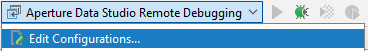
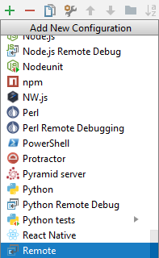

# Aperture Data Studio SDK

The SDK provides a simple Java library to create your own custom steps and extend the capabilities of Aperture Data Studio. You can also add your own custom parsers which will enable Aperture Data Studio to load data from files in a variety of different formats. 

This repo contains the SDK jar and a pre-configured Java project that uses Gradle to easily build your own custom step. Alternatively, you can add the SDK as a dependency to your own project by downloading the SDK jar from the `libs` folder.

The project comes with an `ExampleSteps` module which, when built, will output the SDK examples jar. The example classes demonstrate some key functionality of the SDK along with providing a template class which can be used as a starting point for your own custom steps. There is also a `TemplateParser` which generates some simple output for any input file with a .template extension.

You can view the Javadoc [here](https://experiandataquality.github.io/aperture-data-studio-sdk) for full reference documentation.

## Table of contents

<!-- TOC -->

- [Generating a custom step with the sample project](#generating-a-custom-step-with-the-sample-project)
- [Generating a custom step from a new or existing project](#generating-a-custom-step-from-a-new-or-existing-project)
- [Adding a custom step to Aperture Data Studio](#adding-a-custom-step-to-aperture-data-studio)
- [Creating a custom step](#creating-a-custom-step)
    - [Importing the step SDK](#importing-the-step-sdk)
    - [Configuring your step](#configuring-your-step)
        - [Adding step information](#adding-step-information)
        - [Adding step properties](#adding-step-properties)
    - [Step output](#step-output)
        - [initialise](#initialise)
        - [getValueAt](#getvalueat)
        - [getInputRow](#getinputrow)
- [Multi-threading](#multi-threading)
- [Optimising your Step](#optimising-your-step)
    - [isInteractive flag](#isinteractive-flag)
    - [Caching](#caching)
        - [Cache interface](#cache-interface)
    - [Progress](#progress)
- [Generating a custom parser with the sample project](#generating-a-custom-parser-with-the-sample-project)
- [Generating a custom parser from a new or existing project](#generating-a-custom-parser-from-a-new-or-existing-project)
- [Adding a custom parser to Aperture Data Studio](#adding-a-custom-parser-to-aperture-data-studio)
- [Creating a custom parser](#creating-a-custom-parser)
    - [Importing the parser SDK](#importing-the-parser-sdk)
    - [Configuring the supported filetypes](#configuring-the-supported-filetypes)
    - [Instantiating your parser and creating any required parameters](#instantiating-your-parser-and-creating-any-required-parameters)
    - [Providing a method that attempts to parse the data file](#providing-a-method-that-attempts-to-parse-the-data-file)
    - [Performing the actual parse](#performing-the-actual-parse)
- [Reading Data Studio Properties](#reading-data-studio-values)
    - [Constants](#constants)
    - [Glossary Values](#glossary-values)
    - [Server Properties](#server-properties)
- [Debugging](#debugging)

<!-- /TOC -->


## Generating a custom step with the sample project

The steps below show how to generate a compatible jar file using Gradle:

1. Clone the repo.
2. Open the project in your favourite IDE.
3. Create a new class within the MyCustomSteps module. For the output jar to work correctly it will need to be in the com.experian.aperture.datastudio.sdk.step.addons package - the template class is located there. We recommend that you base your class on one of the examples or use the template class.
4. Open the Gradle window in your IDE and run the MyCustomSteps build task. This will build the jar for the steps you have created.
5. Your new jar will be built to build/libs/MyCustomSteps.jar.

## Generating a custom step from a new or existing project 

If you don't wish to use Gradle, you'll need to configure your own java project to generate a compatible jar artifact:

1. Create a new java project or open an existing one.
2. Download the [sdk.jar](https://github.com/experiandataquality/aperture-data-studio-sdk/raw/master/libs/sdk.jar) file.
3. Create a libs folder and add in the sdk.jar as a library.
4. Create a new package - com.experian.aperture.datastudio.sdk.step.addons.
5. Create a new class in the package you just created.
4. Configure your project to output a jar file as an artifact, this will be done differently depending on your IDE.
 
## Adding a custom step to Aperture Data Studio

To make your custom step available in the Aperture Data Studio UI:

1. Copy your new jar into the addons folder in your Aperture Data Studio installation directory - you should see the new step in the UI.
2. Test your new step by dragging it into your workflow like any other step.

## Creating a custom step 

The sample project in the repository has a pre-configured Gradle build as well as having the SDK included and the correct package name configured. If you would like to start your own project then follow the instructions above.

With your project set up you can now create a new class. If you cloned the sample project you will have a MyCustomSteps module, inside that module you'll find the package com.experian.aperture.datastudio.sdk.step.addons. Create your new classes in this package so that they are correctly picked up by the Data Studio UI.

### Importing the step SDK

In order to make use of the classes and methods, you'll need to import the SDK into your class. Add an import statement below the package name to import all the SDK classes and methods.
``` java
import com.experian.aperture.datastudio.sdk.step.*
```
Your new class should look something like this:

``` java
package com.experian.aperture.datastudio.sdk.step.addons;

import com.experian.aperture.datastudio.sdk.step.*;

public class DemoStep {
}
```
All the classes and methods will now be available to you.

### Configuring your step

The SDK has a `StepConfiguration` class. A custom step class should extend the `StepConfiguration` class. This will allow you to correctly configure your custom step and ensure it displays correctly in the UI.

You can create a new method in your class to set up your step. 

#### Adding step information

Each step needs some basic information to identify it in the Data Studio UI. You'll need to make sure your step has a name, description and icon:

``` java
package com.experian.aperture.datastudio.sdk.step.addons;

import com.experian.aperture.datastudio.sdk.step.*;

import java.util.Collections;
import java.util.Optional;
import java.util.Base64;

public class DemoStep extends StepConfiguration {

    public DemoStep() {
        // Basic step information
        setStepDefinitionName("DemoStep");
        setStepDefinitionDescription("Demonstrates a step");
        setStepDefinitionIcon("INFO");
    }
}
```

#### Adding step properties

Step properties represent step UI elements. These properties could include displaying information about the step, allowing the user to input something or selecting a column to manipulate. The property type is set using the `ofType` method. For example setting the property to be a column chooser would be done with the following code:
``` java
StepProperty arg1 = new StepProperty()
        .ofType(StepPropertyType.COLUMN_CHOOSER);
```

It is also recommended that you update the UI with some prompts and error icons to show the user that more interaction is required before the step will work correctly. You can do this using the `withStatusIndicator`, `withIconTypeSupplier` and `withArgTextSupplier` methods. The example below will show an error icon and display a couple of prompts if no data input is present and subsequently if no column is selected. If all is correct then the name of the column will be displayed.

``` java
StepProperty arg1 = new StepProperty()
        .ofType(StepPropertyType.COLUMN_CHOOSER)
        .withStatusIndicator(sp -> () -> sp.allowedValuesProvider != null)
        .withIconTypeSupplier(sp -> () -> sp.allowedValuesProvider == null ? "ERROR" : "OK")
        .withArgTextSupplier(sp -> () -> sp.allowedValuesProvider == null ? "Connect an input for columns" : (sp.getValue() == null ? "Select a column" : sp.getValue().toString()));
```
Most workflow steps will take in an input and then output something at the other end. To allow input and output you'll need to use `havingInputNode` and `havingOutputNode`. The final part of initial setup for a step property is to call `validateAndReturn` to perform the validation.

``` java
StepProperty arg1 = new StepProperty()
        .ofType(StepPropertyType.COLUMN_CHOOSER)
        .withStatusIndicator(sp -> () -> sp.allowedValuesProvider != null)
        .withIconTypeSupplier(sp -> () -> sp.allowedValuesProvider == null ? "ERROR" : "OK")
        .withArgTextSupplier(sp -> () -> sp.allowedValuesProvider == null ? "Connect an input for columns" : (sp.getValue() == null ? "Select a column" : sp.getValue().toString()))
        .havingInputNode(() -> "input0")
        .havingOutputNode(() -> "output0")
        .validateAndReturn();
```
The property is now ready to be added. The `setStepProperties` method takes a list. For a single property use a `SingletonList`. To add multiple properties, use `Arrays.asList`.

``` java
setStepProperties(Collections.singletonList(arg1));
```

Step output is where the main work is done, you'll need to define a new output class and set it using `setStepOutput`. This method takes a new `StepOutput` class:

``` java
setStepOutput(new DemoOutput());
```

### Step output

Step output classes are configured by extending the `StepOutput` class.

```java
private class DemoOutput extends StepOutput {
}
```

First up you can set the name that appears when viewing the output data by overriding the getName method.

``` java
@Override
public String getName() { return "Demo step"; }
```

#### initialise

The `initialise` method initialises the view and is therefore where you would set up your output columns. You may want to add some columns or replace values in an existing column. You can use the `ColumnManager` class for this.

An example of using the column manager to add a column is below. Here the column manager clears the columns, gets the column selected by the user and adds a column next to it.


``` java
public void initialise() throws Exception {

    getColumnManager().clearColumns();

    String selectedColumnName = getArgument(0);
    if (selectedColumnName != null) {

        getColumnManager().setColumnsFromInput(getInput(0));

        StepColumn selectedColumn = getColumnManager().getColumnByName(selectedColumnName);
        if (selectedColumn != null) {
            int selectedColumnPosition = getColumnManager().getColumnPosition(selectedColumnName);

            getColumnManager().addColumnAt(this, selectedColumnName, "Base64 Encoded column", selectedColumnPosition);
        }
    }
}
```

#### getValueAt
The `getValueAt` object is called for each cell when generating the view or executing the workflow. By default it will simply display the data as it is. If you override this, you can set the values in a specific column.
You'll see in the example below that the row and column are passed in. The example also shows getting the column selected by the user and using those values to set the values of another column.

``` java
@Override
public Object getValueAt(long row, int col) throws Exception {

    // get the user-defined column
    String selectedColumnName = getArgument(0);

    // get the column object from the first input
    Optional<StepColumn> inputColumn = null;
    if (selectedColumnName != null && !selectedColumnName.isEmpty()) {
        inputColumn = getInputColumn(0, selectedColumnName);
    }
    if (inputColumn.isPresent()) {
        // get the input column's value for the selected row
        String value = inputColumn.get().getValue(row).toString();
        // add text and return it
        return Base64.getEncoder().encodeToString(value.getBytes("utf-8"));
    } else {
        // if not found return an empty value. We could alternatively throw an error.
        return "";
    }
}
```

#### getInputRow

Similar to `getValueAt`, the `getInputRow` object array can be called to retrieve data from the view row-by-row. You can do something simple like return a row from a user specified ID by using `getInputRow` in an overridden `getValueAt` method.

``` java
@Override
public Object getValueAt(long row, int col) throws Exception {
    List<StepProperty> properties = getStepProperties();
    if (properties != null && !properties.isEmpty()) {
        String arg1 = getArgument(1);

        if (arg1 != null) {
            try {
                Integer userDefinedInt = Integer.parseInt(arg1);
                // Our custom column
                if (col == 0) {
                    return userDefinedInt;
                }

                // Need to correct the userDefinedInt as it gets passed to getInputRow,
                // Because users will expect 1 to be the index of the first row, but we have a zero-based index here.
                Object[] rowValues = getInputRow(0, userDefinedInt - 1);

                // Need to correct the column index that we get the value for, 
                // to allow for our extra column which we have already defined a value for.
                // e.g. we want the value from the previous column Index because they have all shifted right by one
                return rowValues[col - 1];

            } catch (NumberFormatException ex) {
                logError(ex.getMessage());
            }
        }
    } else {
        return new NullPointerException("Properties is null or empty");
    }
    return null;
}
```

## Multi-threading

In order to improve performance, especially when calling a web service that may have slower response times, it is beneficial to use multiple threads. The EmailValidate example step demonstrates how to make use of multi-threading within a custom step.

## Optimising your step
Your custom step can be optimised by using the following function:
``` java
                Object value = getServerProperty("NAME");
```
#### Step Type
You can optionally specify that your step be a process flow step. Process nodes should be used to perform an operation that does not change the data, for example downloading new reference data, or sending an email notificiation. They differ from normal steps in that they have different connecting nodes, and pass data through unchanged. You do not have to specify any input or output arguments as a single input and output node will be added automatically.
Set the step type to process by adding the following line to the step definition:
``` java
                setStepDefinitionType("PROCESS");
```
There is another step type "PROCESS_ONLY" which prevents the step from being connected to other steps' "data" outputs/inputs.

#### isInteractive flag
This flag is set to true when the step is being used as an interactive drilldown. When false the step is being invoked as part of a workflow execution step, or as input to a view that requires all its data.
``` java
boolean res = isInteractive();
```
This setting is best used during the execution and getValueAt stages of the step, as it can negate the need to process all the input data when being viewed interactively, instead you can just process values when required. 

#### Caching 
The cache object allows a custom step to cache its results for reuse later. Each cache object is created and referenced by a particular name. The cache is global, and is useful for caching responses from slow services between instances of custom steps. The backing key/value datastore is fast enough on reads to be used for random access lookups, and it can handle reads/writes from multiple steps at once. The cache is managed by Aperture Data Studio, but it is the responsibility of the custom step to delete or refresh the cache as necessary.

Caches are created simply or obtained by calling getCache with the name of your cache, which can be any string.
``` java
Cache myCache = getCache("my cache name");
```

##### Cache interface
The cache interface is defined by the following functions. They are called through the Cache object returned by the getCache function described above.

``` java
    String read(String key) throws Exception;
```
Reads a string value from the cache according to the key given. If the key is not found in the cache it will return null.

``` java
    void write(String key, String value) throws Exception;
```
Writes a value string to the cache keyed by the given key string. If the key is already present, the old value will be replaced with the new value.

``` java
    void close() throws Exception;
```
Closes the cache. Should be called when all read/writes are completed - typically in StepOutput.close().

``` java
    void delete() throws Exception;
```
Deletes the cache. Will throw an exception if in use.

``` java
    long getCreateTime();
```

Gets the time when the cache was created.
``` java
    long getModifiedTime();
```
Gets the time when the cache was last modified.

#### Progress
When your step is being executed it may take a long time to run. You can let Data Studio and its users know how far it has got, and therefore approximately how long it will take to finish by sending progress updates to the server. The sendProgess call should be called with a double between 0 and 100 depending how far along your execution as got. For example:

sendProgress(50.0);

Note: When your step's execution function finishes the progress will automatically be set to 100.

## Working with Datastores
You can get access to Aperture Data Studio's datastores and the tables within them through the SDK, obtain information about them and even create new tables or append to existing ones.

### Datastores

#### Get Datastores
To get a list of all datastores available to you call the getDatastores function. This returns a list of Datastore objects that can be further queried.

#### Datastore Interface

This interface allows you to find out about a particular datasource. This includes getting its name, its type, whether it is the current user's private import datastore, get the properties for the datastore and even set some properties. See the javadoc for the Datastore object for more details.
This interface also allows you to obtain a list of tables within the datastore that you are allowed to see, which are returned as TableSDK objects.

##### TableSDK Interface

Objects implementing this interface allow you to interact with individual tables in a datastore. You can query the status of cached data, remove or refresh the cache, read the file or delete it (where applicable).
See the javadoc for the TableSDK interface for more details.

## Generating a custom parser with the sample project

The steps below show how to generate a compatible jar file using Gradle:

1. Clone the repo.
2. Open the project in your favourite IDE.
3. Create a new class within the MyCustomSteps module. For the output jar to work correctly it will need to be in the com.experian.aperture.datastudio.sdk.parser.addons package. We recommend that you use the template class located here.
4. Open the Gradle window in your IDE and run the MyCustomSteps build task. This will build the jar for the steps you have created.
5. Your new jar will be built to build/libs/MyCustomSteps.jar.

## Generating a custom parser from a new or existing project 

If you don't wish to use Gradle, you'll need to configure your own java project to generate a compatible jar artifact:

1. Create a new java project or open an existing one.
2. Download the [sdk.jar](https://github.com/experiandataquality/aperture-data-studio-sdk/raw/master/libs/sdk.jar) file.
3. Create a libs folder and add in the sdk.jar as a library.
4. Create a new package - com.experian.aperture.datastudio.sdk.parser.addons.
5. Create a new class in the package you just created.
4. Configure your project to output a jar file as an artifact, this will be done differently depending on your IDE.
 
## Adding a custom parser to Aperture Data Studio

To make your custom step available in the Aperture Data Studio UI:

1. Copy your new jar into the addons folder in your Aperture Data Studio installation directory.
2. Test your new parser by dragging in a file type which it supports to the Data Explorer.

## Creating a custom parser 

The sample project in the repository has a pre-configured Gradle build as well as having the SDK included and the correct package name configured. If you would like to start your own project then follow the instructions above.

With your project set up you can now create a new class. If you cloned the sample project you will have a MyCustomSteps module, inside that module you'll find the package com.experian.aperture.datastudio.sdk.parser.addons. Create your new class in this package so that it is correctly picked up by the Data Studio UI.

### Importing the parser SDK

In order to make use of the classes and methods, you'll need to import the SDK into your class. Add an import statement below the package name to import all the SDK classes and methods.
``` java
import com.experian.aperture.datastudio.sdk.parser.*
```
Your new class should look something like this:

``` java
package com.experian.aperture.datastudio.sdk.parser.addons;

import com.experian.aperture.datastudio.sdk.parser.*;

public class ParserTemplate extends CustomParser {
}
```

All the classes and methods will now be available to you.

### Configuring the supported filetypes

Your first task is to determine the filetypes that your parser will support. You should override the getSupportedFileExtensioins method for this purpose.

``` java
    private static String[] allowableFileTypes = {
        "yourextension"
    };

    @Override
    public final List<String> getSupportedFileExtensions() {
        // Return all allowed file types.
        return Arrays.asList(allowableFileTypes);
    }
```

### Instantiating your parser and creating any required parameters

The template parser constructor looks like this; you should replace the parameters in the call to the constructor base class with an apt brief name and description. 

``` java
    public ParserTemplate() {
        super("Template", "Parser Template");
    }
```

Your parser may need to infer, or to be supplied, parameters that help it to understand the file. In the case of a CSV parser for example, it may be possible to supply the field separator.

If your parser requires parameters, they should be created in the constructor. Note that each parameter has an ID which is used to reference it.

Parameters can be string or boolean as determined by the ParserPropertyType parameter. 

Override the getProperties method to return all the parameters that your parser supports.

``` java
    import com.experian.aperture.datastudio.sdk.parser.ParserProperty;

    private static final String ROW_COUNT_ID = "RowCount";
    private List<ParserProperty> properties;

    public ParserTemplate() {
        super("Template", "Parser Template");

        properties = new ArrayList<>();

        ParserProperty rows = new ParserProperty(ParserPropertyType.STRING, "Row count", "The number of rows in each table", ROW_COUNT_ID);

        properties.add(rows);
    }
    
    @Override
    public final List<ParserProperty> getProperties() {
        return properties;
    }
```

This creates a single property which stores the number of rows to be returned. Override the getProperties method to return the stored properties. You will set default values for these properties at a later stage.

### Providing a method that attempts to parse the data file

Override the attemptParse method. This method receives a stream supplier (so that multiple passes can be made if necessary), a filename and the parameter list.

The method must determine whether the file can be parsed (or may be parsable with additional user help in configuration) and return that status to the caller. It must also set up any required configuration parameters that are to be presented to the user. If the file can be parsed, this method must also describe the tabular structure of the data as it will appear in Data Studio. 

Below, we take a look at this method in detail.

``` java
    @Override
    public final ParseResult attemptParse(final Supplier<InputStream> streamSupplier, final String filename, final List<ParserParameter> parameterConfiguration) throws CustomParseException {
        String started = String.format("Template parsing attempted for %s", filename);
        log(started);
```

You can use log() to write an informational message to the server log file or logError() for more serious problems. Use getLoggingLevel() to read the value of the custom parser server logging level. Typically, zero means no logging, 1 is used for minimal logging of major events and general information and 2 is used to provide logging at the record level; however, it is your decision as to how you interpret the values.

Next, take a copy of the parameters provided or create any new ones that are required to parse the file. The parameters are referred to by their ID. Data Studio will not supply parameters when initially attempting to parse the file but the user can update any that your parser provides. If you do not wish the user to have control over a parser value, it should not be stored as a parameter. 

Here, for demonstration purposes, we set the number of records to be returned by the parser. The file can be configured within the Data Explorer to return a different number of rows. In a normal situation, the row count would be determined by the file contents.

``` java
        List<ParserParameter> localParameters = new ArrayList<>();
   
        if (parameterConfiguration == null) {
            ParserParameter.updateParameters(localParameters, ROW_COUNT_ID, String.valueOf(DEFAULT_ROWS));
        } else {
            localParameters.addAll(parameterConfiguration);
        }
```

The following code creates two output files, each with a fixed number of columns. These output files are both attached to the result as is the set of parameters that the parser is using.

These parameters will be passed back into the parser in the future and will be applied the next time that it is parsed (any user configuration will also be applied). 

Note that this template parser does not actually look at the file provided. It simply creates dummy data based on a trivial algorithm. 

``` java
        List<ParseOutput> outputs = new ArrayList<>();

        int tableCount = 2;

        for (int table = 0; table < tableCount; table++) {
            List<Column> columns = new ArrayList<>();

            for (int i = 0; i < COLUMN_COUNT; i++) {
                String name = String.format("T%d H%d", table + 1, i + 1);
                Column column = new Column(null, i, name, name);
                columns.add(column);
            }

            ParseOutput output = new ParseOutput(String.format("Table %d", table + 1), String.format("This is table number %d", table + 1));
            output.setColumns(columns);

            outputs.add(output);
        }

        ParseResult result = new ParseResult();

        result.setStatus(ParseStatus.PARSED);

        result.setOutputs(outputs);

        result.setParameters(localParameters);

        return result;
    }
```
#### Result status

A result status must be set to indicate the level of success.

If the file cannot be parsed, return NOT_PARSABLE. If parsing is not currently possible but user configuration may help, return POSSIBLY_PARSABLE so that the user can adjust the values as appropriate.

Note that by returning NOT_PARSABLE, the file will not appear in the Data Explorer (unless another parser is able to understand it) and this may prove confusing for the user. By setting the status to POSSIBLY_PARSABLE, the file will appear with an 'Error' label against it.

### Performing the actual parse

Once the file is satisfactorily accepted and configured by Data Studio, it will call out to the parse method to retrieve the rows. This method must be overridden by your parser and must return an iterator which returns an array of Objects containing the cell data for each row.

We now walk through the template parser implementation which - for simplicity - does not refer to the supplied file when supplying the row data.

This method accepts the input stream, the filename, the index of the file that is being retrieved (your parser may only return one file), a list of parameters and a maximum row count which can be used to optimise loading.

The wrapping code parses the supplied parameter in a defensive manner and sets the current row to zero.

``` java
    @Override
    public final Iterator<Object[]> parse(final InputStream input, final String filename, final int outputIndex, final List<ParserParameter> parameterConfiguration, final int maxRows) throws CustomParseException {
        int rowTotal;

        try {
            String rows = ParserParameter.getStringParameter(parameterConfiguration, ROW_COUNT_ID);

            rowTotal = Integer.valueOf(rows);
        } catch (Exception ex) {
            rowTotal = DEFAULT_ROWS;
        }

        final int rowCount = rowTotal;

        return new Iterator<Object[]>() {
           ...
        }
    }
 ```
 
The iterator contains two methods; an indicator of whether more rows exist and a method to get the next row. The implementation of the template parser iterator is shown below but a real world case would obviously need to examine the contents of the input file.

Furthermore, the implementation may vary significantly depending on the output index as this would most likely require the examination of a different part of the file.
 
``` java
    @Override
    public final Iterator<Object[]> parse(final InputStream input, final String filename, final int outputIndex, final List<ParserParameter> parameterConfiguration, final int maxRows) throws CustomParseException {
        ...
        
        return new Iterator<Object[]>() {
            private int currentRow = 0;

            @Override
            public boolean hasNext() {
                return currentRow < rowCount;
            }

            @Override
            public Object[] next() {
                if (hasNext()) {
                    Object[] result = new Object[COLUMN_COUNT];
                    if (currentRow < rowCount) {
                        ++currentRow;

                        for (int c = 0; c < COLUMN_COUNT; c++) {
                            result[c] = String.format("T%d R%d C%d", outputIndex + 1, currentRow, c + 1);
                        }
                    }

                    return result;
                }

                throw new NoSuchElementException();
            }
        };
    }
 ```
 
 ### Exceptions
 
 Where the custom parser is faced with an unexpected situation, the `CustomParseException` class can be used to throw an exception. Whilst the attemptParse method should be made fairly resilient to unexpected content (and use the result status where possible), the actual parse method should throw exceptions of this class when it encounters a situation it cannot handle. 
 
 ## Reading Data Studio Values
 
 Various Data Studio properties are accessible through the SDK:
 
 #### Constants
 This function obtains the value of a constant value stored in Data Studio. 
 In Data Studio constants are stored under the Glossary area under the Constants tab. The name to pass to the function is typically the constant name uppercased and with spaces replaced with underscores. 
 For example, to obtain the regular expression for validating emails:
 ``` java
                 Object res = getConstantByName("EMAIL_ADDRESS");
 ```
 
 #### Glossary Values
 This function obtains groups of values defined under one glossary item in Data Studio. 
 For example to get a list of all the blocking keys:
 ``` java
                 List<Object> values = getGlossaryValues("EXPERIAN_MATCH_BLOCKING_KEYS");
 ```
 
 #### Server Properties
 You can obtain a list of values under a particular Data Studio property using:
 ``` java
                 List<String> dnsServers = getServerObjectProperties("DNSServers", "CONTENT");
 ```
 Alternatively you can obtain a single server property, as defined in Data Studio or set in the server's server.properties file:
 ``` java
                 Object value = getServerProperty("NAME");
 ```

 ## Debugging
  To enable standard Java's remote debugging feature:
 1. Install Aperture Data Studio. Please [contact us](https://www.edq.com/data-quality-management/aperture-data-quality-management-platform/) to get the latest version.
 1. Go to the installation directory of Aperture Data Studio.
 1. Edit `Aperture Data Studio Service 64bit.ini`.
 1. Alter the following property: **`Virtual Machine Parameters`**
     ```properties
     Virtual Machine Parameters=-Xms66:1000:16000P -Xmx66:1000:16000P -agentlib:jdwp=transport=dt_socket,server=y,suspend=n,address=5005
     ```
 1. Open Intellij IDEA, click _Edit Configurations..._
 
      
 
 1. Click the `+` button and add new remote debugging:
 
       
 
 1. Click OK.
 1. Place a debug point in your addons code.
 1. Restart Aperture Data Studio.
 1. Now you can debug your custom addons code.
  **NOTE**: make sure `-agentlib:jdwp=transport=dt_socket,server=y,suspend=n,address=5005` is removed in the production
 environment.