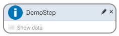
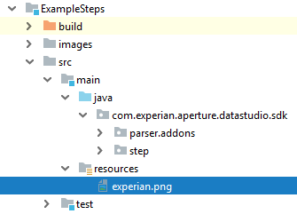
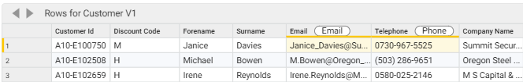
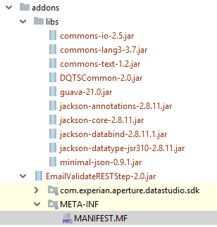
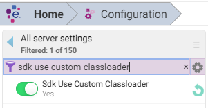

# Aperture Data Studio SDK

The SDK provides a simple Java library to create and test your own custom steps, and extend the capabilities of [Data Studio](https://www.edq.com/documentation/aperture-data-studio/). You can also add your own custom parsers, which will enable Data Studio to load data from files in a variety of different formats. 

This repo contains the SDK jar and a pre-configured Java project that uses Gradle, which allows you to easily build your own custom step. Alternatively, you can add the SDK as a dependency to your own project by downloading the SDK jar from the `libs` folder.

The project comes with an `ExampleSteps` module as a sample guide to use the SDK. The [example classes](ExampleSteps/src/main/java/com/experian/aperture/datastudio/sdk/step/examples) 
demonstrate some key functionality of the SDK and provide a template class which can be used as a starting point for your 
own custom steps. There is also a `TemplateParser` which generates some simple output for any input file with a .template 
extension. For more detail, please refer to `ExampleSteps`'s [`README.md`](ExampleSteps/README.md).

You can view the Javadoc [here](https://experiandataquality.github.io/aperture-data-studio-sdk/) for full reference documentation.

## Table of contents

<!-- TOC -->

- [Generating a custom step with the sample project](#generating-a-custom-step-with-the-sample-project)
- [Generating a custom step from a new or existing project](#generating-a-custom-step-from-a-new-or-existing-project)
- [Creating a custom step](#creating-a-custom-step)
    - [Importing the step SDK](#importing-the-step-sdk)
    - [Configuring your step](#configuring-your-step)
        - [Adding step information](#adding-step-information)
        - [Adding step properties](#adding-step-properties)
    - [Step output](#step-output)
        - [initialise](#initialise)
        - [getValueAt](#getvalueat)
        - [getInputRow](#getinputrow)
- [Multi-threading](#multi-threading)
- [Class-isolation](#class-isolation)
- [Optimizing a Step](#optimizing-a-step)
    - [Step type](#step-type)
    - [isInteractive flag](#isinteractive-flag)
    - [Caching](#caching)
        - [Cache interface](#cache-interface)
    - [Progress](#progress)
- [Testing a custom step](#testing-a-custom-step)
    - [Adding the test framework SDK dependency](#adding-the-test-framework-sdk-dependency)
    - [Writing custom step tests](#writing-custom-step-tests)
    - [Test Framework API](#test-framework-api)
        - [Configuration API](#configuration-api)
        - [Execution and Assertion API](#execution-and-assertion-api)
- [Adding a custom step to Data Studio](#adding-a-custom-step-to-data-studio)
- [Generating a custom parser with the sample project](#generating-a-custom-parser-with-the-sample-project)
- [Generating a custom parser from a new or existing project](#generating-a-custom-parser-from-a-new-or-existing-project)
- [Creating a custom parser](#creating-a-custom-parser)
    - [Importing the parser SDK](#importing-the-parser-sdk)
    - [Configuring the supported filetypes](#configuring-the-supported-filetypes)
    - [Instantiating your parser and creating any required parameters](#instantiating-your-parser-and-creating-any-required-parameters)
    - [Providing a method that attempts to parse the data file](#providing-a-method-that-attempts-to-parse-the-data-file)
        - [Result status](#result-status)
    - [Performing the actual parse](#performing-the-actual-parse)
    - [Exceptions](#exceptions)
- [Adding a custom parser to Data Studio](#adding-a-custom-parser-to-data-studio)
- [Working with datastores](#working-with-datastores)
    - [Get datastores](#get-datastores)
    - [Datastore interface](#datastore-interface)
    - [TableSDK interface](#tablesdk-interface)
- [Reading Data Studio properties](#reading-data-studio-properties)
    - [Constants](#constants)
    - [Glossary values](#glossary-values)
    - [Server properties](#server-properties)
- [Debugging](#debugging)

<!-- /TOC -->


## Generating a custom step with the sample project

The steps below show how to generate a compatible jar file using Gradle:

1. Clone the repo.
2. Open the project in your IDE of choice.
3. Custom step skeleton is available at [StepTemplate.java](ExampleSteps/src/main/java/com/experian/aperture/datastudio/sdk/step/addons/StepTemplate.java). 
   Please take note that the package structure `com.experian.aperture.datastudio.sdk.step.addons` must be respected as 
   it's where Aperture Data Studio scan for custom steps. 
4. You may remove the example custom steps located at [example step package](ExampleSteps/src/main/java/com/experian/aperture/datastudio/sdk/step/examples) to reduce the build size.
5. To build your step, you can run `gradle build` either from IDE or command prompt. Refer to the [documentation](ExampleSteps/README.md) of 
   ExampleStep for more detail on the build step.
6. Your new jar will be built and copied to `ExampleSteps/build/libs/ExampleSteps-all.jar`.

## Generating a custom step from a new or existing project 

If you don't wish to use Gradle, you'll need to configure your own Java project to generate a compatible jar artifact:

1. Create a new Java project or open an existing one.
2. Download the [sdk.jar](https://github.com/experiandataquality/aperture-data-studio-sdk/raw/master/libs/sdk.jar) file 
   and optionally [sdk-test-framework](https://github.com/experiandataquality/aperture-data-studio-sdk/raw/master/libs/sdk-test-framework.jar). 
   
   Alternatively if you use Gradle, you can point to sdk repository in the `build.gradle`: 
   
   ```gradle
   apply plugin: 'java'
  
   repositories {
       mavenCentral()
       maven {
            url 'https://raw.githubusercontent.com/experiandataquality/aperture-data-studio-sdk/github-maven-repository/maven'
       }
   }
   
   dependencies {
       compileOnly("com.experian.aperture:sdk:1.4.0")
       testCompile("com.experian.aperture:sdk-test-framework:1.4.0")
   }
   ```
   
   If you're using Maven, modify `pom.xml` to add SDK github repository: 
   
   ```xml 
   <project xmlns="http://maven.apache.org/POM/4.0.0"
            xmlns:xsi="http://www.w3.org/2001/XMLSchema-instance"
            xsi:schemaLocation="http://maven.apache.org/POM/4.0.0
                                http://maven.apache.org/maven-v4_0_0.xsd">
       <modelVersion>4.0.0</modelVersion>
       <groupId>com.experian.aperture.datastudio.sdk.step.addons</groupId>
       <!-- replace this accordingly with your custom step name -->
       <artifactId>MyCustomStep</artifactId>
       <!-- replace this accordingly with your custom step version -->
       <version>1.0-SNAPSHOT</version>
       <packaging>jar</packaging>
       <!-- replace this accordingly with your custom step name -->
       <name>MyCustomStep</name>
   
       <repositories>
           <repository>
               <id>aperture-data-studio-github-repo</id>
               <url>https://raw.githubusercontent.com/experiandataquality/aperture-data-studio-sdk/github-maven-repository/maven/</url>
           </repository>
       </repositories>
   
       <dependencies>
           <dependency>
               <groupId>com.experian.aperture</groupId>
               <artifactId>sdk</artifactId>
               <version>1.4.0</version>
               <scope>provided</scope>
           </dependency>
           <dependency>
               <groupId>com.experian.aperture</groupId>
               <artifactId>sdk-test-framework</artifactId>
               <version>1.4.0</version>
               <scope>test</scope>
           </dependency>
       </dependencies>
   </project>
   ```
   
3. If in the previous step you downloaded the jar manually, create a libs folder and add in the sdk.jar as a library. 
   You can skip this step if you're using maven or gradle.
4. Create a new package called `com.experian.aperture.datastudio.sdk.step.addons`.
5. Create a new class in the package you just created.
6. Configure your project to output a jar file as an artifact. Note that this will be done differently depending on your IDE.

## Creating a custom step 

The sample project in the repository has a pre-configured Gradle build, it includes the SDK, and has the
 correct package name configured. However, if you want to start your own project, then follow the [instructions above](#generating-a-custom-step-from-a-new-or-existing-project).

With your project set up, you can now create a new class. If you cloned the sample project, you will have a
`ExampleSteps` module. Inside that module, you'll find the `com.experian.aperture.datastudio.sdk.step.addons` package.
Create your new classes in this package so that they are correctly picked up by the Data Studio UI.

You can bundle multiple custom steps into a single jar as long as they're located under `com.experian.aperture.datastudio.sdk.parser.addons` 

### Importing the step SDK

To use the classes and methods, you need to import the SDK into your class. Add an import statement below the package name to import all the SDK classes and methods.
``` java
import com.experian.aperture.datastudio.sdk.step.*
```
Your new class should look something like this:

``` java
package com.experian.aperture.datastudio.sdk.step.addons;

import com.experian.aperture.datastudio.sdk.step.*;

public class DemoStep {
}
```
All the SDK classes and methods are now available to you.

### Configuring your step

The SDK has a `StepConfiguration` class. You should use a custom step class to extend the `StepConfiguration` class. This will allow you to correctly configure your custom step and ensure it displays correctly in the Data Studio UI.

You can create a new method in your class to set up your step. 

#### Adding step information

Each step needs some basic information to identify it in the Data Studio UI. You'll need to make sure your step has a name, description and icon:

``` java
package com.experian.aperture.datastudio.sdk.step.addons;

import com.experian.aperture.datastudio.sdk.step.*;

import java.util.Collections;
import java.util.Optional;
import java.util.Base64;

public class DemoStep extends StepConfiguration {

    public DemoStep() {
        // Basic step information
        setStepDefinitionName("DemoStep");
        setStepDefinitionDescription("Demonstrates a step");
        setStepDefinitionIcon("INFO");
    }
}
```
##### Setting Step Icon
As demonstrated above, a custom step icon can be set via the `setStepDefinitionIcon` method. 



Below are the standard icons that can be used.

|Icon Name|Image||Icon Name|Image|
|---|---|---|---|---|
|ALPHA_NUMERIC|||DATABASE||
|EMAIL|||ERROR||
|INFO|||INTEGER||
|OK|||PERCENT||
|ROWS|||TABLES||

Beside these standard icons, you can define your own custom icon too.


1.  Create your own icon file in PNG format. Preferable size is 64 x 64 pixels.
2.  Put your icon file in `/src/main/resources/` folder, so that it will be bundled inside your JAR file.
3.  Call `setStepDefinitionIcon` method inside your `StepConfiguration` constructor with the icon filename.
    ```java
    public CustomIconStep() {
        setStepDefinitionName("Custom - Icon");
        setStepDefinitionDescription("Custom step with custom icon");
        setStepDefinitionIcon("experian.png");
    ```
Please refer to `CustomIconStep` source code in [ExampleSteps](ExampleSteps/src/main/java/com/experian/aperture/datastudio/sdk/step/examples).

#### Adding step properties

Step properties represent step UI elements. These properties include displaying information about the step, allowing the user to input something, or selecting a column to manipulate. The property type is set using the `ofType` method. For example, setting the property to be a column chooser can be done with the following code:
``` java
StepProperty arg1 = new StepProperty()
        .ofType(StepPropertyType.COLUMN_CHOOSER);
```

|StepPropertyType|Description|
|---|---|
|BOOLEAN        |`true` or `false` field|
|STRING         |Text field|
|INTEGER        |Number without fraction|
|DECIMAL        |Number with fraction|
|COLUMN_CHOOSER |Input column drop down list|
|MULTI_COLUMN_CHOOSER|Input column drop down list that allow multiple selection|
|CUSTOM_CHOOSER      |Custom drop down list|
|MULTI_CUSTOM_CHOOSER|Custom drop down list that allow multiple selection (Version 1.5+)|
|INPUT_LABEL         |Display text|

It is also recommended that you update the UI with some prompts and error icons to show the user that more interaction is required before the step will work correctly. You can do this by using the `withStatusIndicator`, `withIconTypeSupplier` and `withArgTextSupplier` methods. The example below will show an error icon and display a couple of prompts if no data input is present and subsequently if no column is selected. If all is correct, then the name of the column will be displayed.

``` java
StepProperty arg1 = new StepProperty()
        .ofType(StepPropertyType.COLUMN_CHOOSER)
        .withStatusIndicator(sp -> () -> sp.allowedValuesProvider != null)
        .withIconTypeSupplier(sp -> () -> sp.allowedValuesProvider == null ? "ERROR" : "OK")
        .withArgTextSupplier(sp -> () -> sp.allowedValuesProvider == null ? "Connect an input for columns" : (sp.getValue() == null ? "Select a column" : sp.getValue().toString()));
```
Most workflow steps will take in an input and then output something at the other end. To allow input and output you'll need to use `havingInputNode` and `havingOutputNode`. The final part of the initial setup for a step property is to call `validateAndReturn` to perform the validation.

``` java
StepProperty arg1 = new StepProperty()
        .ofType(StepPropertyType.COLUMN_CHOOSER)
        .withStatusIndicator(sp -> () -> sp.allowedValuesProvider != null)
        .withIconTypeSupplier(sp -> () -> sp.allowedValuesProvider == null ? "ERROR" : "OK")
        .withArgTextSupplier(sp -> () -> sp.allowedValuesProvider == null ? "Connect an input for columns" : (sp.getValue() == null ? "Select a column" : sp.getValue().toString()))
        .havingInputNode(() -> "input0")
        .havingOutputNode(() -> "output0")
        .validateAndReturn();
```
The property is now ready to be added. The `setStepProperties` method takes a list of properties. For a single property, use a `SingletonList`. To add multiple properties, use `Arrays.asList`.

``` java
setStepProperties(Collections.singletonList(arg1));
```

The `StepOutput` is where the main work is done. You'll need to define a new output class and set it by using `setStepOutput`. This method takes a new `StepOutput` class:

``` java
setStepOutput(new DemoOutput());
```

##### Multiple inputs

From Data Studio version 1.5 onward, custom step support multiple inputs.
``` java
final StepProperty arg0 = new StepProperty()
        .ofType(StepPropertyType.COLUMN_CHOOSER)
        .withStatusIndicator(sp -> () -> sp.allowedValuesProvider != null && sp.getValue() != null)
        .withIconTypeSupplier(sp -> () -> sp.allowedValuesProvider != null && sp.getValue() != null ? ICON_OK : ICON_ERROR)
        .withArgTextSupplier(sp -> () -> sp.allowedValuesProvider == null ? "<Connect 1st input>" : (sp.getValue() == null ? "<Select 1st Input 1st column>" : sp.getValue().toString()))
        .havingInputNode(() -> "input0") // add new input node `input0` and define arg0's options
        .havingOutputNode(() -> "output0")
        .validateAndReturn();

final StepProperty arg1 = new StepProperty()
        .ofType(StepPropertyType.COLUMN_CHOOSER)
        .withStatusIndicator(sp -> () -> sp.allowedValuesProvider != null && sp.getValue() != null)
        .withIconTypeSupplier(sp -> () -> sp.allowedValuesProvider != null && sp.getValue() != null ? ICON_OK : ICON_ERROR)
        .withArgTextSupplier(sp -> () -> sp.allowedValuesProvider == null ? "<Connect 2nd input>" : (sp.getValue() == null ? "<Select 2nd input 1st column>" : sp.getValue().toString()))
        .havingInputNode(() -> "input1") // add new input node `input1` and define arg1's options
        .validateAndReturn();

final StepProperty arg2 = new StepProperty()
        .ofType(StepPropertyType.MULTI_COLUMN_CHOOSER)
        .withStatusIndicator(sp -> () -> sp.allowedValuesProvider != null && sp.getValue() != null)
        .withIconTypeSupplier(sp -> () -> sp.allowedValuesProvider != null && sp.getValue() != null ? ICON_OK : ICON_ERROR)
        .withArgTextSupplier(sp -> () -> sp.allowedValuesProvider == null ? "<Connect 2nd input>" : (sp.getValue() == null ? "<Select 2nd input multi columns>" : sp.getValue().toString()))
        .havingInputNode(() -> "input1") // define arg2's options with input1's columns
        .validateAndReturn();

```

`havingInputNode` method on `StepProperty` will add input node to the custom step, if the returning name is unique. `arg2.havingInputNode(() -> "input1")` in the code above only defines the drop down list item with `input1`'s columns. As `input1` already defined in `arg2`, no new input node is added.

```java
@Override
public Object getValueAt(long row, int columnIndex) {
    final String firstInputFirstColumn = getArgument(0);
    final String secondInputFirstColumn = getArgument(1);
    final Optional<StepColumn> firstArg = getInputColumn(0, firstInputFirstColumn);
    final Optional<StepColumn> secondArg = getInputColumn(1, secondInputFirstColumn);
    final StringBuilder sb = new StringBuilder();
    try {
        if (firstArg.isPresent()) {
            sb.append(firstArg.get().getValue(row).toString()).append(", "); 
        }
        if (secondArg.isPresent()) {
            sb.append(secondArg.get().getValue(row).toString());
        }
    } catch (Exception ignore) {
        // intentionally empty
    }
```
In the `StepOutput`, you can get the data from second input by calling `getInputColumn(inputIndex=1, columnName)` method.

Please refer the full source code of `MultiInputColumnChooserStep` in [ExampleSteps](ExampleSteps/src/main/java/com/experian/aperture/datastudio/sdk/step/examples).


##### Disable multi column chooser's select all
By default, the _select all_ checkbox is visible: 


To hide _select all_ checkbox: 

```java 
// Note that this features is only available in Aperture Data Studio 1.4.0 onwards.
final StepProperty multiChooser = new StepProperty()
    .ofType(StepPropertyType.MULTI_COLUMN_CHOOSER)
    // detail omitted
    .withSelectAllOption(false);
```

##### Automatically select column based on data tag
Data Studio allows columns to be tagged columns with an additional label. Refer to [Data Tagging](https://www.edq.com/documentation/aperture-data-studio/user-guide/#data-tagging) for more info. 

The column chooser step property can automatically select a column tagged with specific label (e.g. 'Phone') once the custom step connected with an input.



```java
public class ColumnTagStep extends StepConfiguration {

    private static final String TAG_PHONE = "Phone";
    
    public ColumnTagStep() {
        setStepDefinitionName("Custom - Column Tag");
        setStepDefinitionIcon("INFO");

        final StepProperty spPhone = new StepProperty()
                .ofType(StepPropertyType.COLUMN_CHOOSER)
                .withStatusIndicator(sp -> () -> isPhoneArgOk(sp))
                .withIconTypeSupplier(sp -> () -> isPhoneArgOk(sp) ? "OK" : "ERROR")
                .withArgTextSupplier(sp -> () -> getPhoneArgText(sp))
                .havingInputNode(() -> "input0")
                .havingOutputNode(() -> "output0")
                .validateAndReturn();
        setStepProperties(Arrays.asList(spPhone));

        setStepOutput(new ColumnTagOutput());
    }

    private boolean isPhoneArgOk(final StepProperty sp) {
        autoSelectTaggedColumn(sp, TAG_PHONE);
        return sp.allowedValuesProvider != null && sp.getValue() != null;
    }

    private String getPhoneArgText(final StepProperty sp) {
        autoSelectTaggedColumn(sp, TAG_PHONE);
        if (sp.allowedValuesProvider == null) {
            return "<Connect an input>";
        } else {
            return sp.getValue() == null ? "<Select a phone column>" : sp.getValue().toString();
        }
    }
```

The code above is very similar to normal step configuration, except it will call the `autoSelectTaggedColumn` method every time it updates the UI with `withStatusIndicator`, `withIconTypeSupplier` and `withArgTextSupplier` methods.

```java

/**
* Automatically set step property's value to a column tagged with specific label name.
* This is done by comparing data tags in all input columns.
* @param sp StepProperty
* @param tag tag name
*/
private void autoSelectTaggedColumn(final StepProperty sp, final String tag) {
    if (sp.allowedValuesProvider != null) {
        if (sp.getValue() == null) {
            final Optional<StepColumn> tagColumn = sp.getInputColumns().stream().filter(c -> c.getDataTags().contains(tag)).findFirst();
            if (tagColumn.isPresent()) {
                final String colName = tagColumn.get().getDisplayName();
                sp.setValue(colName);
            }
        }
    }
}
```

`autoSelectTaggedColumn` method will only perform if the input is connected and the step property value is null. It will find the first input column with the data tag matched the `tag` value. If found, that input column's name is set as the step property value.

`StepColumn.getDataTags` method is used to get the tagged label of the column.

Please refer the full source code of `ColumnTagStep` in [ExampleSteps](ExampleSteps/src/main/java/com/experian/aperture/datastudio/sdk/step/examples).


### Step output

Step output classes are configured by extending the `StepOutput` class.

```java
private class DemoOutput extends StepOutput {
}
```

First up, you can set the name that appears when viewing the output data by overriding the `getName` method.

``` java
@Override
public String getName() { return "Demo step"; }
```

#### initialise

The `initialise` method initializes the view and is therefore where you would set up your output columns. You may want to add some columns or replace values in an existing column. You can use the `ColumnManager` class to do so.

In the example below, the ColumnManager clears the columns, retrieves the column selected by the user, and adds a column next to it.

``` java
public void initialise() throws Exception {

    getColumnManager().clearColumns();

    String selectedColumnName = getArgument(0);
    if (selectedColumnName != null) {

        getColumnManager().setColumnsFromInput(getInput(0));

        StepColumn selectedColumn = getColumnManager().getColumnByName(selectedColumnName);
        if (selectedColumn != null) {
            int selectedColumnPosition = getColumnManager().getColumnPosition(selectedColumnName);

            getColumnManager().addColumnAt(this, selectedColumnName, "Base64 Encoded column", selectedColumnPosition);
        }
    }
}
```

#### getValueAt
The `getValueAt` method is called for each cell when generating the view or executing the workflow. By default, it displays the data as it is. If you override this, you can set the values in a specific column. In the example below you can see that the row and column are passed in. The example also shows how to use `getValueAt` to get the column selected by the user and use those values for another column.

``` java
@Override
public Object getValueAt(long row, int col) throws Exception {

    // get the user-defined column
    String selectedColumnName = getArgument(0);

    // get the column object from the first input
    Optional<StepColumn> inputColumn = null;
    if (selectedColumnName != null && !selectedColumnName.isEmpty()) {
        inputColumn = getInputColumn(0, selectedColumnName);
    }
    if (inputColumn.isPresent()) {
        // get the input column's value for the selected row
        String value = inputColumn.get().getValue(row).toString();
        // add text and return it
        return Base64.getEncoder().encodeToString(value.getBytes("utf-8"));
    } else {
        // if not found return an empty value. We could alternatively throw an error.
        return "";
    }
}
```

#### getInputRow

Similar to `getValueAt`, the `getInputRow` object array can be called to retrieve data from the view row-by-row.
 You can do something simple like return a row from a user specified ID by using `getInputRow` in an overridden
 `getValueAt` method.

``` java
@Override
public Object getValueAt(long row, int col) throws Exception {
    List<StepProperty> properties = getStepProperties();
    if (properties != null && !properties.isEmpty()) {
        String arg1 = getArgument(1);

        if (arg1 != null) {
            try {
                Integer userDefinedInt = Integer.parseInt(arg1);
                // Our custom column
                if (col == 0) {
                    return userDefinedInt;
                }

                // Need to correct the userDefinedInt as it gets passed to getInputRow,
                // Because users will expect 1 to be the index of the first row, but we have a zero-based index here.
                Object[] rowValues = getInputRow(0, userDefinedInt - 1);

                // Need to correct the column index that we get the value for, 
                // to allow for our extra column which we have already defined a value for.
                // e.g. we want the value from the previous column Index because they have all shifted right by one
                return rowValues[col - 1];

            } catch (NumberFormatException ex) {
                logError(ex.getMessage());
            }
        }
    } else {
        return new NullPointerException("Properties is null or empty");
    }
    return null;
}
```

## Multi-threading

In order to improve performance, especially when calling a web service that may have slower response times, we recommend using multiple threads. The `EmailValidate` example step demonstrates how to make use of multi-threading within a custom step.

## Class-isolation

By default every custom step `JAR` files are isolated in its own class-loader. The class-loader used will scan libraries 
relative to the custom-step. This allow custom-step to use libraries that have different version from other custom steps   
and Aperture Data Studio itself without the need to _shade_ into different packages. 

Some note on the custom step packaging: 

1. When using [Gradle shadow plugin](https://imperceptiblethoughts.com/shadow/) or [Maven shade plugin](https://maven.apache.org/plugins/maven-shade-plugin/),
   try not to `minimize` the resulting jar as it may remove dependencies that are loaded through reflection or service-provider-interface, i.e.
   
   Gradle:
   
   ```groovy
   shadowJar {
       minimize() // don't use this
   }
   ```
   
   Maven: 
   
   ```xml 
    <plugin>
       <groupId>org.apache.maven.plugins</groupId>
       <artifactId>maven-shade-plugin</artifactId>
       <version>3.2.1</version>
       <executions>
         <execution>
           <phase>package</phase>
           <goals>
             <goal>shade</goal>
           </goals>
           <configuration>
             <!-- don't use this -->
             <minimizeJar>true</minimizeJar>
           </configuration>
         </execution>
       </executions>
    </plugin>
   ```
   
1. When using centralized libs folder, make sure that all of the dependencies jars are referred inside the custom step's 
   `MANIFEST.MF`:

    
    
    ```
    Manifest-Version: 1.0
    Class-Path: libs/DQTSCommon-1.4.jar libs/json-20160810.jar libs/log4j-
     api-2.10.0.jar libs/jackson-datatype-jsr310-2.8.11.jar libs/jackson-d
     atabind-2.8.11.1.jar libs/jackson-core-2.8.11.jar libs/jackson-annota
     tions-2.8.11.jar libs/guava-21.0.jar libs/commons-io-2.5.jar libs/com
     mons-text-1.2.jar libs/commons-lang3-3.7.jar libs/minimal-json-0.9.1.
     jar
    ```
    
### Feature Toggle

Toggle off _Sdk Use Custom Classloader_ to revert the behavior to pre-1.5.0. When toggled off, all custom steps will be 
loaded by single system class loader.



## Optimizing a step
Your custom step can be optimized by using the following function:

``` java
Object value = getServerProperty("NAME");
```
### Step type
You can specify (optionally) if your step is a process flow step. Process nodes should be used to perform operations that don’t change the data, e.g. downloading new reference data, or sending an email notification. Process flow steps differ from normal steps: they have different connecting nodes, and pass data through unchanged. You do not have to specify any input or output arguments as a single input and output node will be added automatically. Set the step type to process by adding the following line to the step definition:

``` java
setStepDefinitionType("PROCESS");
```

There is another step type: `PROCESS_ONLY`, which prevents the step from being connected to other steps' "data" outputs/inputs.

### isInteractive flag
This flag is set to true when the step is used as an interactive drilldown. When false, the step is invoked as part of a workflow execution step, or as an input to a view that requires all its data.
 
``` java
boolean res = isInteractive();
```

This setting is best used during the execution and `getValueAt` stages of the step, as it can negate the need to process all the input data when being viewed interactively. Instead, you can just process values when required. 

### Caching 

The cache object allows a custom step to cache its results, for later reuse. Each cache object is created and referenced 
by a particular name. The cache is _scoped to each custom step class_, which means that 2 instances of the same custom 
step in 2 different workflows can use the same cache if both supplied the same cache name. It is useful for storing 
responses from slow services between instances of custom steps. The backing key/value datastore is fast enough on reads 
to be used for random access lookups, and it can handle reads/writes from multiple steps at once. The cache is managed 
by Data Studio, but it is the responsibility of the custom step to delete or refresh the cache as necessary.

Caches are created or obtained by calling `StepOutput#getCache` method with the name of your cache, which can be any 
string. `StepOutput#getCache` call is thread safe. Example below create or obtain (if it's already created) a cache with 
default configuration:

``` java
public class MyCustomStepOutput extend StepOutput {
    // ... detail omitted
    @Override
    public void execute() {
        final Cache myCache = getCache("MyCache");
    }
}
```

Each record inside a cache is tied to _time-to-leave_ value. _Time-to-leave_ value is uniform across a single cache, 
however, eviction event for each record is different as it's based on `creation time + _time-to-leave_ value`. To 
illustrate this:

CacheA: Time-to-leave 1 hour

* Record A: 
    * creation time 10:00 AM
    * eviction time approximately 10:01 AM
* Record B: 
    * creation time 10:05 AM
    * eviction time approximately 11:05 AM
    
Example below illustrate how to create a cache with custom time-to-leave: 

```java 
public class MyCustomStepOutput extend StepOutput {
    // ... detail omitted
    @Override
    public void execute() {
        final Cache cache30s = getCache(CacheConfiguration.withName(SECOND_CACHE).withTtl(30, TimeUnit.SECONDS));
    }
}
```

Please take note that eviction time is not a _hard realtime_ and there is going to be a few second delay from the real 
eviction time due to the asynchronous nature of the mechanism. 

Cache default properties values: 

* Time-to-leave: 1 day. Configurable as `Sdk.cacheTTL` system property.
* Eviction pool size: 2. Configurable as `Sdk.cacheEvictionPoolSize` system property.
* Eviction interval: 10 seconds. Configurable as `Sdk.cacheEvictionInterval` system property.
* Initial allocation file size: 5 MB. Configurable as `Sdk.cacheAllocateFileSize` system property.
* File increment size: 5 MB. Configurable as `Sdk.cacheIncrementFileSize` system property.

#### Cache interface

The cache interface is defined by the functions presented below. They are called through the `Cache` object returned by the `getCache` function described above.

``` java
String read(String key) throws Exception;
```
Reads a string value from the cache according to the given key. If the key is not found in the cache, a null result is returned.

``` java
void write(String key, String value) throws Exception;
```
Writes a value string to the cache keyed by the given key string. If the key is already present, the old value will be replaced with the new value.

``` java
void close() throws Exception;
```
Closes the cache. Should be called when all read/writes are completed - typically in `StepOutput.close()`.

```java 
String remove(String key)
```
Remove a single record from the cache. It will return the removed cache value if record exists.

```java 
void clear()
```
Remove all records from a cache.

``` java
void delete() throws Exception;
```
Deletes the cache. Will throw an exception if in use.

``` java
long getCreateTime();
```
Gets the time when the cache was created.

``` java
long getModifiedTime();
```
Gets the time when the cache was last modified.

### Progress
When your step is being executed, it may take a long time to run. You can let Data Studio and its users know how far it has advanced, and approximatively how long it will take to finish, by sending progress updates to the server. The `sendProgess` call should be called with a double between 0 and 100 depending how far along your execution has progressed. For example:

```java
sendProgress(50.0);
```

Note that when your step's execution function finishes, the progress will automatically be set to 100.


## Testing a custom step
 
Apart from providing all the resources you need to develop custom steps, the SDK also contains a test framework that can help you test custom steps at component level. The test framework uses JUnit.

The test framework helps mock the behavior of Data Studio where a custom step is installed and used in a workflow. 
This ensures the custom step works as intended. The test framework is also useful for creating regression tests.
 
### Adding the test framework SDK dependency
 
If you are building the custom step from the sample project, the test framework has already been included as a test dependency.
 
1.	Download the [sdk-test-framework.jar](https://github.com/experiandataquality/aperture-data-studio-sdk/raw/master/libs/sdk-test-framework.jar).
2.	Add it into the libs folder.
3.	Add the test framework as a test dependency. 
 
### Writing custom step tests
 
We recommend you create tests based on `StepTemplate`. The test suite template allows you to start building regression tests, and ensures the custom step works as intended in Data Studio.

There is also an example step with tests that shows you how to write tests for a custom step that consumes an external
 REST API service.
 
### Test framework API
 
The test framework RESTful service is separated into two parts:
- The *configuration* API, which simulates the Data Studio UI configuration. 
- The *execution/assertion* API, which executes the step in a workflow.
   
#### Configuration API
 
In order to be executed, a custom step must first be configured. This might involve:
- Connecting the step to an input (e.g. a source step or a previous step’s output).
- The user having to input some argument values defined in the custom step's properties.
- The custom step depending on a certain constant, glossary or property during execution.

The Configuration API helps set up all the above, so the custom step can be executed. 
 
The `StepTestBuilder` class allows you to configure both the target step to test, and the mock behavior of Data Studio.
 
 ```java
// Use the option to target the custom step directly by instantiating the step class yourself. This is useful if the
// step contains a constructor overload with mock-able external dependencies.
StepTestBuilder
    .fromCustomStep(new MyCustomStepConfiguration())
 ```
 
or 
 
 ```java
 // Use this option to load the custom step bundled in a jar.
 StepTestBuilder
    .fromJar("path/to/MyCustomStep.jar")
    .useCustomStep("MyCustomStep")
    
 ```
 
You need to specify the input to your test. The sample below simulates a scenario where the custom step’s input is
 connected to the output of another step. Typically, the output of a step is in the form of a table. You can specify
 a CSV file as the input for the test.
 
 ```java
 StepTestBuilder
    .fromCustomStep(new MyCustomStepConfiguration())
    .withCsvInput("path/to/input.csv")
 ```
 
To mock the Data Studio values so that the custom step can access them in the test, use the method provided.
 
 ```java
 StepTestBuilder
     .fromCustomStep(new MyCustomStepConfiguration())
     .withServerProperty(propertyName, propertyValue) // Specify the required server properties
     .withConstantValues(constantValues) // Specify a collection of server constant values, or
     .withConstantValue(name, value) // Add a single server constant value 
 ```
 
Set `isInteractive` to true, to simulate the `Show data` event.
 
 ```java
  StepTestBuilder
      .fromCustomStep(new MyCustomStepConfiguration())
      .isInteractive(true) // This makes StepOutput.isInteractive() returns true
 ```
 
The test framework records the progress of calls throughout the step execution, so that they can be asserted later.

Additionally, there is also a method that allows you to hook a custom progress callback if required.
 
 ```java
 StepTestBuilder
    .fromCustomStep(new MyCustomStepConfiguration())
    .onProgressReport((message, progress) -> { 
       // do something with the progress
    })
 ``` 
 
Before the step can be executed, the step property values (or argument) will need to be specified. For example, specify
 the selected column from the output of the previous step.
 
 ```java
 StepTestBuilder
    .fromCustomStep(new MyCustomStepConfiguration())
    .withCsvInput("path/to/input.csv") // input.csv contains a column named "Color id"
    .withStepPropertyValue(0, "Color id") // Specify that for the first step property (argument), you want to choose the column "Color id"
 ```
 
After you are done configuring the test, call the `build()` method, which returns a `TestSession` object. This object represents the current test. It contains the methods to execute the custom step and to assert its result.
 
The build also validates the following:
- That the target step is not null. This might happen when the step is loaded from a jar file.
- That the step has a valid package name. Each custom step has to be in the package derived from a specific name,
 e.g. `com.experian.aperture.datastudio.sdk.step`
- That `StepOutput` has been initialized. Each step configuration will need to call `setStepOutput()` to initialize the step output.
- That the input node doesn’t have duplicate names.
- That there is only one output node (the current SDK version doesn’t support multiple output nodes).
 
 ```java
 StepTestBuilder
     .fromCustomStep(new MyCustomStepConfiguration())
     .withCsvInput("path/to/input.csv") // input.csv contains a column named "Color id"
     .withStepPropertyValue(0, "Color id")
     .build()
 ```
 
#### Execution and Assertion API
 
Before testing the execution of the step, you should assert the step has the expected properties (arguments),
 input nodes, and output node.
 
 ```java
 StepTestBuilder
      .fromCustomStep(new MyCustomStepConfiguration())
      ... // Removed for brevity
      .build()
      .getArgumentCount() // Get the step properties or argument count defined in the StepConfiguration and then assert
      // or
      .getInputNodeCount() // Get the input node count and then assert
      // or
      .getOutputNodeCount() // Get the output node count and then assert
 ``` 
 
Call `execute()` to execute the custom step. A `SDKAssertion` object is returned, which contains the methods to assert the execution output. If the step is not complete, a `SDKTestException` will be thrown.
 
 ```java
 final SDKAssertion assertion = StepTestBuilder
       .fromCustomStep(new MyCustomStepConfiguration())
       ... // Removed for brevity
       .build()
       .execute(); // Throws SDKTestException if the step is not complete (e.g. did not set an argument/property value)

 ```
 
Assert that the output columns are as expected after the execution.
 
 ```java
 // Continuing from the assertion object returned by execute()
 assertion
    .assertColumnName(3, "My custom column") // Assert the column added by the custom step.
    .assertColumnSize(3) // Assert the number of columns is correct.
    
 ```
 
Assert the rows from the input are executed or processed as expected.
 
 ```java
 // Continuing from the assertion object returned by execute()
 assertion
    .assertThatAllRowsIsExecuted() // Assert that the number of executed rows matches the number of input rows.
    // or
    .assertExecutedRowCount() // Assert the specific number of executed rows; for scenarios where StepOutput.execute() returns a different value than the number of input rows (e.g. filter step).
 ```
 
Assert the output column values from the step are as expected. The column assertion returns an `SDKAsyncAssertion`
 object, as it is an asynchronous operation. This helps simulate the behavior in Data Studio where the grid view
 column value is typically processed asynchronously. This way, you can also test that the `getValueAt()` from the
 `StepOutput` is thread-safe.
 
 ```java
 assertion
    .assertColumnValueAt(row1, column3, "Value") // Assert that at row 1, column 3, the value is as expected.
    .assertColumnValueAt(row2, column3, "Value2")
    .waitForAssertion() // Wait for the asynchronous assertion to finish.
 ```
 
Other than asserting the output rows and columns, there are also miscellaneous API calls you can use to assert various
 parts of the step execution.
 
 ```java
 assertion
    .assertServerProperty(key, value) // Assert the server property is as expected.
    // or
    .closeCustomStep()                          // Simulates the StepOutput's close event.
    .assertCacheIsValid(myCacheName)            // Assert that the cache is still valid after closing the step.
    .assertCacheValue(myCacheName, key, value)  // Assert the value stored in cache during or after execution is as expected.
    // or
    .assertArgumentValue(index, value) // Assert the argument value is as expected.
 ```
 
## Adding a custom step to Data Studio

To make your custom step available in the Data Studio UI:

1. Copy your new jar into the addons folder in your Data Studio installation directory. You should see the new step in the UI.
2. Test your new step by dragging it into your workflow.

## Generating a custom parser with the sample project

The steps below show how to generate a compatible jar file using Gradle:

1. Clone the repo.
2. Open the project in your IDE of choice.
3. Custom parser skeleton is available at [ParserTemplate.java](ExampleSteps/src/main/java/com/experian/aperture/datastudio/sdk/parser/addons/ParserTemplate.java). 
   Please take note that the package structure `com.experian.aperture.datastudio.sdk.parser.addons` must be respected as 
   it's where Aperture Data Studio scan for custom parser. 
4. You may remove the example custom steps located at [example step package](ExampleSteps/src/main/java/com/experian/aperture/datastudio/sdk/step/examples) to reduce the build size.
5. To build your parser, you can run `gradle build` either from IDE or command prompt. Refer to the [documentation](ExampleSteps/README.md) of 
   ExampleStep module for more detail on the build step.
6. Your new jar will be built and copied to `ExampleSteps/build/libs/ExampleSteps-all.jar`.

## Generating a custom parser from a new or existing project 

If you don't wish to use Gradle, you'll need to configure your own Java project to generate a compatible jar artifact:

1. Create a new Java project or open an existing one.
2. Download the [sdk.jar](https://github.com/experiandataquality/aperture-data-studio-sdk/raw/master/libs/sdk.jar) file 
   and optionally [sdk-test-framework](https://github.com/experiandataquality/aperture-data-studio-sdk/raw/master/libs/sdk-test-framework.jar). 
   
   Alternatively if you use Gradle, you can point to sdk repository in the `build.gradle`: 
   
   ```gradle
   apply plugin: 'java'
   
   repositories {
       mavenCentral()
       maven {
            url 'https://raw.githubusercontent.com/experiandataquality/aperture-data-studio-sdk/github-maven-repository/maven'
       }
   }
   
   dependencies {
       compileOnly("com.experian.aperture:sdk:1.4.0")
       testCompile("com.experian.aperture:sdk-test-framework:1.4.0")
   }
   ```
   
   If you're using Maven, modify `pom.xml` to add SDK github repository: 
   
   ```xml 
   <project xmlns="http://maven.apache.org/POM/4.0.0"
            xmlns:xsi="http://www.w3.org/2001/XMLSchema-instance"
            xsi:schemaLocation="http://maven.apache.org/POM/4.0.0
                                http://maven.apache.org/maven-v4_0_0.xsd">
       <modelVersion>4.0.0</modelVersion>
       <groupId>com.experian.aperture.datastudio.sdk.step.addons</groupId>
       <!-- replace this accordingly with your custom step name -->
       <artifactId>MyCustomStep</artifactId>
       <!-- replace this accordingly with your custom step version -->
       <version>1.0-SNAPSHOT</version>
       <packaging>jar</packaging>
       <!-- replace this accordingly with your custom step name -->
       <name>MyCustomStep</name>
   
       <repositories>
           <repository>
               <id>aperture-data-studio-github-repo</id>
               <url>https://raw.githubusercontent.com/experiandataquality/aperture-data-studio-sdk/github-maven-repository/maven/</url>
           </repository>
       </repositories>
   
       <dependencies>
           <dependency>
               <groupId>com.experian.aperture</groupId>
               <artifactId>sdk</artifactId>
               <version>1.4.0</version>
               <scope>provided</scope>
           </dependency>
           <dependency>
               <groupId>com.experian.aperture</groupId>
               <artifactId>sdk-test-framework</artifactId>
               <version>1.4.0</version>
               <scope>test</scope>
           </dependency>
       </dependencies>
   </project>
   ```

3. If you downloaded the jar manually, create a libs folder and add in the sdk.jar as a library. You can skip this step 
   if you're using Maven or Gradle.
4. Create a new package called `com.experian.aperture.datastudio.sdk.parser.addons`.
5. Create a new class in the package you just created.
6. Configure your project to output a jar file as an artifact. Note that this will be done differently depending on your IDE.

## Creating a custom parser 

The sample project in the repository has a pre-configured Gradle build, it includes the SDK, and has the correct package name configured. However, if you want to start your own project, then follow the [instructions above](#generating-a-custom-parser-from-a-new-or-existing-project).

With your project set up, you can now create a new class. If you cloned the sample project you will have a `ExampleSteps` module. 
Inside that module you'll find the `com.experian.aperture.datastudio.sdk.parser.addons` package. Create your new class 
in this package so that it is correctly picked up by the Data Studio UI.

You can bundle multiple parsers into a single jar as long as they're located under `com.experian.aperture.datastudio.sdk.parser.addons` 

### Importing the parser SDK

To use the classes and methods, you need to import the SDK into your class. Add an import statement below the package name to import all the SDK classes and methods.

``` java
import com.experian.aperture.datastudio.sdk.parser.*
```

Your new class should look something like this:

``` java
package com.experian.aperture.datastudio.sdk.parser.addons;

import com.experian.aperture.datastudio.sdk.parser.*;

public class ParserTemplate extends CustomParser {
}
```

All the SDK classes and methods are now available to you.

### Configuring the supported filetypes

First of all, you have to determine the filetypes that your parser will support. You should override the `getSupportedFileExtensions` method for this purpose.

``` java
private static String[] allowableFileTypes = {
    "yourextension"
};

@Override
public final List<String> getSupportedFileExtensions() {
    // Return all allowed file types.
    return Arrays.asList(allowableFileTypes);
}
```

### Instantiating your parser and creating any required parameters

The template parser constructor looks like this: 

``` java
public ParserTemplate() {
    super("Template", "Parser Template");
}
```

You should replace the parameters in the call to the constructor base class with an appropriate brief name and description.

Your parser may need to infer, or to be supplied, parameters that help it understand the file type. In the case of a CSV parser, for example, you could supply the field separator.

If your parser requires parameters, they should be created in the constructor. Note that each parameter has an ID which is used to reference it.

Parameters can be string or boolean as determined by the `ParserPropertyType` parameter. 

Override the `getProperties` method to return all the parameters that your parser supports.

``` java
import com.experian.aperture.datastudio.sdk.parser.ParserProperty;

private static final String ROW_COUNT_ID = "RowCount";
private List<ParserProperty> properties;

public ParserTemplate() {
    super("Template", "Parser Template");

    properties = new ArrayList<>();

    ParserProperty rows = new ParserProperty(ParserPropertyType.STRING, "Row count", "The number of rows in each table", ROW_COUNT_ID);

    properties.add(rows);
}

@Override
public final List<ParserProperty> getProperties() {
    return properties;
}
```

This creates a single property, which stores the number of rows to be returned. Override the `getProperties` method to return the stored properties. You will set default values for these properties at a later stage.

### Providing a method that attempts to parse the data file

Override the `attemptParse` method. This method receives a stream supplier (so that multiple passes can be made if necessary),
 a filename, and the parameter list.

The method must determine whether the file can be parsed (or may be parsable with additional user help in configuration) and return that status to the caller. It must also set up any required configuration parameters that are to be presented to the user. If the file can be parsed, this method must also describe the tabular structure of the data as it will appear in Data Studio. 

Below, we take a look at this method in detail.
``` java
@Override
public final ParseResult attemptParse(final Supplier<InputStream> streamSupplier, final String filename, final List<ParserParameter> parameterConfiguration) throws CustomParseException {
    String started = String.format("Template parsing attempted for %s", filename);
    log(started);
```

You can use `log()` to write an informational message to the server log file, or `logError()` for more serious problems.
 Use `getLoggingLevel()` to read the value of the custom parser server logging level. Typically, zero means no logging,
 1 is used for minimal logging of major events and general information, and 2 is used to provide logging at the record
 level. However, it is your decision how you want to interpret the values.

Next, take a copy of the parameters provided or create any new ones that are required to parse the file. The parameters are referred to by their ID. Data Studio will not supply parameters when initially attempting to parse the file, but the user can update any that your parser provides. If you do not wish the user to have control over a parser value, it should not be stored as a parameter. 

In the example below, for demonstration purposes, we set the number of records to be returned by the parser. The file can be configured within the Data Explorer to return a different number of rows. In a normal situation, the row count would be determined by the file contents.

``` java
List<ParserParameter> localParameters = new ArrayList<>();

if (parameterConfiguration == null) {
    ParserParameter.updateParameters(localParameters, ROW_COUNT_ID, String.valueOf(DEFAULT_ROWS));
} else {
    localParameters.addAll(parameterConfiguration);
}
```

The code below creates two output files, each with a fixed number of columns. These output files are both attached to the result, as is the set of parameters that the parser is using.

These parameters will be passed back into the parser in the future and will be applied the next time that it is parsed (any user configuration will also be applied). 

Note that this template parser does not actually look at the file provided. It simply creates dummy data based on a trivial algorithm. 

``` java
    List<ParseOutput> outputs = new ArrayList<>();

    int tableCount = 2;

    for (int table = 0; table < tableCount; table++) {
        List<Column> columns = new ArrayList<>();

        for (int i = 0; i < COLUMN_COUNT; i++) {
            String name = String.format("T%d H%d", table + 1, i + 1);
            Column column = new Column(null, i, name, name);
            columns.add(column);
        }

        ParseOutput output = new ParseOutput(String.format("Table %d", table + 1), String.format("This is table number %d", table + 1));
        output.setColumns(columns);

        outputs.add(output);
    }

    ParseResult result = new ParseResult();

    result.setStatus(ParseStatus.PARSED);

    result.setOutputs(outputs);

    result.setParameters(localParameters);

    return result;
}
```
#### Result status

A result status must be set to indicate the level of success.

If the file cannot be parsed, return `NOT_PARSABLE`. If parsing is not currently possible but user configuration may help,
 return `POSSIBLY_PARSABLE` so that the user can adjust the values as appropriate.

Note that by returning `NOT_PARSABLE`, the file will not appear in the Data Explorer (unless another parser is able to understand it)
 and this may prove confusing for the user. By setting the status to `POSSIBLY_PARSABLE`, the file will appear with
 an 'Error' label against it.

### Performing the actual parse

Once the file is satisfactorily accepted and configured by Data Studio, it will call out to the parse method to retrieve the rows. This method must be overridden by your parser and must return an iterator which returns an array of objects containing the cell data for each row.

We will now cover the template parser implementation, which, for simplicity, does not refer to the supplied file when supplying the row data.

This method accepts:
 - The input stream. 
 - The filename.
 - The index of the file that is being retrieved (your parser may only return one file).
 - A list of parameters.
 - A maximum row count which can be used to optimize loading.

The wrapping code parses the supplied parameter in a defensive manner and sets the current row to zero.

``` java
@Override
public final Iterator<Object[]> parse(final InputStream input, final String filename, final int outputIndex, final List<ParserParameter> parameterConfiguration, final int maxRows) throws CustomParseException {
    int rowTotal;

    try {
        String rows = ParserParameter.getStringParameter(parameterConfiguration, ROW_COUNT_ID);

        rowTotal = Integer.valueOf(rows);
    } catch (Exception ex) {
        rowTotal = DEFAULT_ROWS;
    }

    final int rowCount = rowTotal;

    return new Iterator<Object[]>() {
        ...
    }
}
 ```
 
The iterator contains two methods: an indicator of whether more rows exist, and a method to get the next row. The implementation of the template parser iterator is shown below, but in a real-world use case, it would obviously need to examine the contents of the input file.

Furthermore, the implementation may vary significantly depending on the output index, as this would most likely require the examination of a different part of the file.
 
``` java
@Override
public final Iterator<Object[]> parse(final InputStream input, final String filename, final int outputIndex, final List<ParserParameter> parameterConfiguration, final int maxRows) throws CustomParseException {
    ...
    
    return new Iterator<Object[]>() {
        private int currentRow = 0;

        @Override
        public boolean hasNext() {
            return currentRow < rowCount;
        }

        @Override
        public Object[] next() {
            if (hasNext()) {
                Object[] result = new Object[COLUMN_COUNT];
                if (currentRow < rowCount) {
                    ++currentRow;

                    for (int c = 0; c < COLUMN_COUNT; c++) {
                        result[c] = String.format("T%d R%d C%d", outputIndex + 1, currentRow, c + 1);
                    }
                }

                return result;
            }

            throw new NoSuchElementException();
        }
    };
}
 ```
 
### Exceptions
 
When the custom parser is faced with an unexpected situation, the `CustomParseException` class can be used to throw an exception. Whilst the `attemptParse` method should be made fairly resilient to unexpected content (and use the result status where possible), the actual parse method should throw exceptions of this class when it encounters a situation it cannot handle. 
 
## Adding a custom parser to Data Studio

To make your custom parser available in the Data Studio UI:

1. Copy your new jar into the addons folder in your Data Studio installation directory.
2. Test your new parser by dragging in a file type which it supports to the Data Explorer.

## Working with datastores

The SDK allows you to get access to Data Studio's datastores and the tables within them, obtain information about them, and even create new tables or append to existing ones.

### Get datastores

To get a list of all datastores available to you, call the `getDatastores` function. This returns a list of `Datastore` objects that can be further queried.

### Datastore interface

This interface allows you to find out more about a particular data source: its name, its type, if it’s the current user’s private import datastore. The interface also enables you to retrieve and even set properties for the datastore and to retrieve a list of tables (`TableSDK` objects) within the datastore which you are allowed to see.
  
See the `Datastore` object in the Javadoc for more details. 

### TableSDK interface

Objects implementing this interface allow you to interact with individual tables in a datastore. You can: 

- Query the status of cached data.
- Remove or refresh the cache.
- Read the file or delete it (where applicable).

See the `TableSDK` interface in the Javadoc for more details.

## Reading Data Studio properties
 
Various Data Studio properties are accessible through the SDK:
 
### Constants

This function obtains the value of a constant value stored in Data Studio (the Glossary area under the Constants tab). 
The name to pass to the function is typically the constant name, written in uppercase and with underscores replacing 
spaces. For example, to obtain the regular expression for validating emails:

``` java
final Optional<String> constantValue = ServerValueUtil.getGlossaryConstant("EMAIL_ADDRESS");
```

Since 1.5, `StepOutput#getConstantByName(String)` has been marked as deprecated in favor of 
`ServerValueUtil.getGlossaryConstant(String)`. `ServerValueUtil` provide more flexibility such as retrieving constant 
inside a constructor of `StepConfiguration`.  
 
### Glossary values
This function obtains groups of values defined under one glossary item in Data Studio. 
This is only used to get a list of the DNS servers.

``` java
List<Object> values = getGlossaryValues("DNS_SERVERS");
```
 
### Server properties

To obtain a server property as defined in Data Studio, or set in the server's `server.properties` file:

```java 
final Optional<Object> serverPropertyValue = ServerValueUtil.getServerProperty("System.locale");
```

Alternatively, you can obtain a list of values under a particular Data Studio property by using (note that this method 
only accessible inside child class of `StepOutput`):

``` java
List<String> dnsServers = getServerObjectProperties("DNSServers", "CONTENT");
```

Since 1.5, `StepOutput#getServerProperty(String)` has been marked as deprecated in favor of 
`ServerValueUtil.getServerProperty(String)`. `ServerValueUtil` provide more flexibility such as retrieving constant 
inside a constructor of `StepConfiguration`.  

## Debugging
To enable Java's standard remote debugging feature:
1. Install Data Studio. Please [contact us](https://www.edq.com/data-quality-management/aperture-data-quality-management-platform/) to get the latest version.
2. Go to the installation directory of Data Studio.
3. Edit `Aperture Data Studio Service 64bit.ini`.
4. Alter the **`Virtual Machine Parameters`** property.
    ```properties
    Virtual Machine Parameters=-Xms66:1000:16000P -Xmx66:1000:16000P -agentlib:jdwp=transport=dt_socket,server=y,suspend=n,address=5005
    ```
5. Open IntelliJ IDEA, and click __Edit Configurations...__

    

6. Click the `+` button and add new remote debugging:

    

7. Click __OK__.
8. Place a debug point in your addons code.
9. Restart Data Studio.
10. Now you can debug your custom addons code.
**NOTE**: make sure `-agentlib:jdwp=transport=dt_socket,server=y,suspend=n,address=5005` is removed in the production
environment.