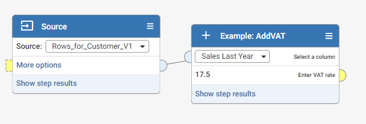

# Aperture Data Studio SDK

The SDK provides a simple Java library to create and test your own custom Workflow steps, extending Aperture Data Studio capabilities. You can also add your own custom parsers which will enable Data Studio to load data from files. 

This repo contains the SDK JAR and a pre-configured Java project that uses Gradle, allowing you to easily build your own custom step. Alternatively, you can add the SDK as a dependency to your own project by downloading the SDK JAR from the `sdkapi` folder.

[Javadoc reference](https://experiandataquality.github.io/aperture-data-studio-sdk) for full reference documentation.

## Table of contents

- [Compatibility matrix between SDK and Data Studio version](#compatibility-matrix-between-sdk-and-data-studio-version)
- [Generating a custom step from a new or existing project](#generating-a-custom-step-from-a-new-or-existing-project)
- [Comparison of SDK v1.0 and v2.0](#comparison-of-sdk-v10-and-v20)
- [Creating a custom step](#creating-a-custom-step)
    - [Importing the step SDK](#importing-the-step-sdk)
    - [Creating your metadata](#creating-your-metadata)
        - [Adding metadata](#adding-metadata)
        - [Metadata sample code](#metadata-sample-code)
    - [Configuring your step](#configuring-your-step)
        - [Adding nodes](#adding-nodes)
            - [Process node](#process-node)
        - [Adding step properties](#adding-step-properties)
            - [asBoolean](#asboolean)
            - [asString](#asstring)
            - [asNumber](#asnumber)
            - [asColumnChooser](#ascolumnchooser)
            - [asCustomChooser](#ascustomchooser)
        - [Configure withOnValueChanged](#configure-withonvaluechanged)
        - [Configure isCompleteHandler](#configure-iscompletehandler)
        - [Configure column layouts](#configure-column-layouts)
        - [Configuration input context](#configuration-input-context) 
        - [StepConfigurationBuilder sample code](#stepconfigurationbuilder-sample-code)
    - [Processing your step](#processing-your-step)
        - [Execute step](#execute-step)
        - [StepProcessorBuilder sample code](#stepprocessorbuilder-sample-code)
        - [Cell value style](#cell-value-style)
        - [isInteractive flag](#isinteractive-flag)
        - [Evaluator](#evaluator)
		- [Progress bar handling](#progress-bar-handling)    
        - [Processor input context](#processor-input-context)     
    - [The Cache configuration](#the-cache-configuration)
        - [Cache scope](#cache-scope)
            - [Workflow](#workflow)
            - [Step](#step)
        - [Create cache](#create-cache)
        - [Cache configuration](#cache-configuration)
        - [Get or create cache](#get-or-create-cache)
        - [Destroy cache](#destroy-cache)
        - [Assigning value to cache](#assigning-value-to-cache)
        - [Getting value from cache](#getting-value-from-cache)
    - [Custom step exception](#custom-step-exception)
    - [Step setting](#step-setting)
        - [Creating step setting](#creating-step-setting)
        - [Accessing step setting](#accessing-step-setting)
- [Class-isolation](#class-isolation)
- [The Logging library](#the-logging-library)
- [The HTTP Client library](#the-http-client-library)
- [Best practices and limitation](best-practices.md)
- [Generating a custom parser from a new or existing project](#generating-a-custom-parser-from-a-new-or-existing-project)
- [Creating a custom parser](#creating-a-custom-parser)
  - [Importing the parser SDK](#importing-the-parser-sdk)
  - [Creating your metadata](#creating-your-metadata-1)
  - [Configuring your parser](#configuring-your-parser)
    - [Supported file extension](#supported-file-extension)
    - [Parameter definition](#parameter-definition)
    - [Display type](#display-type)
    - [Set default value](#set-default-value)
    - [Set processor](#set-processor)
  - [Parser Processor](#parser-processor)
    - [Get table definition](#get-table-definition)
      - [TableDefinitionContext](#tabledefinitioncontext)
    - [Get row iterator](#get-row-iterator)
      - [TableDefinitionContext](#tabledefinitioncontext-1)
      - [ClosableIteratorBuilder](#closableiteratorbuilder)
- [Debugging](#debugging)


## Compatibility matrix between SDK and Data Studio version

| SDK version                                                                          | Compatible Data Studio version | New features released |
|--------------------------------------------------------------------------------------|--------------------------------|-----------------------|
| 2.4.0                                                                                | 2.4.0 (or newer)               | <ul><li>Capability to specify default value for column chooser and custom chooser. This would allow any existing workflow to continue to use without any breaking change while introducing new properties during a minor upgrade.</li><li>An overloaded withDefaultValue method at Configuration which provide you a reference context to other step properties, settings and column definitions (only applicable for column chooser)</li></ul>                                                                            |                               
| 2.3.0                                                                                | 2.1.0 (or newer)               | <ul><li>Capability to rename input node label. You can now specify a text for the input node of your step instead of the default "Connect an input".</li><li>Data tags are now stored as part of column details.</li><li>A new getColumnsByTag method at Configuration and Processing. This will allow you to retrieve column details for a given data tag.</li><li>Custom Chooser now supports value and display name for each item defined. You can now set a friendly name to be displayed in the chooser while maintaining ids for backend processing.</li><li>Fixed SDK Test framework bug for failing to retrieve value from `getStepCell`.</li></ul>
| [2.2.0](https://github.com/experiandataquality/aperture-data-studio-sdk/tree/v2.2.0) | 2.0.11 (or newer)              | <ul><li>A new On value change handler for step properties. This will provide you with more control over the step properties in your custom step (e.g. you can reset the selection of subsequent step properties once the value in the preceding step property has changed).</li><li>A new Locale parameter. This will allow the users to select the "Language and region" settings when uploading a file with the custom parser. The parser will then be able to deserialize the file based on the selected setting.</li><li>SDK custom parser test framework. The SDK test framework has now been extended to cater for custom parser testing at component level as well.</li><li>New custom icons added:<ul><li>Dynamic Feed</li><li>Experian</li></ul></li></ul> |
| [2.1.1](https://github.com/experiandataquality/aperture-data-studio-sdk/tree/v2.1.1) | 2.0.9 (or newer)               | New custom icons added:<ul><li>Australia Post</li><li>Collibra</li><li>Dynamics365</li><li>Salesforce</li><li>Tableau</li></ul> |
| [2.1.0](https://github.com/experiandataquality/aperture-data-studio-sdk/tree/v2.1.0) | 2.0.6 (or newer)               |<ul><li>Accessing Step Settings at the Step Configuration stage, so that API calls can be made using the credentials in the Step Settings to populate the Step Properties.</li><li>Password type field in Step Settings to ensure masking and encryption of sensitive information.</li><li>Custom Step Exception. Custom step developer can define error IDs and descriptions.</li></ul>| 
| [2.0.0](https://github.com/experiandataquality/aperture-data-studio-sdk/tree/v2.0.0) | 2.0.0 (or newer)               ||
| [1.6.2](https://github.com/experiandataquality/aperture-data-studio-sdk/tree/v1.6.2) | 1.6.2                          |
| [1.6.1](https://github.com/experiandataquality/aperture-data-studio-sdk/tree/v1.6.1) | 1.6.1 (up to 1.6.2)            |
| [1.6.0](https://github.com/experiandataquality/aperture-data-studio-sdk/tree/v1.6.0) | 1.6.0 (up to 1.6.2)            |
| [1.5.1](https://github.com/experiandataquality/aperture-data-studio-sdk/tree/v1.5.1) | 1.5.1 (up to 1.6.2)            |
| [1.5.0](https://github.com/experiandataquality/aperture-data-studio-sdk/tree/v1.5.0) | 1.5.0 (up to 1.6.2)            |


### Notes

- Both the Data Studio and SDK version follows [semantic version](https://semver.org/) notation where for version *a.b.c*; *a*, *b*, *c* indicate the major, minor and patch version respectively. Each SDK version released will be exclusively tied to a compatible Data Studio version.

- Any custom steps built on an SDK version, will work on the Data Studio version that it is tied to, as well as any newer version onwards. 
    - Example 1: Custom steps built on SDK v2.0.0 will work on Data Studio v2.0.0, v2.0.6 and onwards.
    - Example 2: Custom steps built on SDK v2.1.0 will work on Data Studio v2.0.6 and onwards.

- Any features provided by a newer version of the SDK will not be supported on an older version of Data Studio.
    - Example 1: Custom steps using new features from SDK v2.1.0 will not work on a Data Studio version that is earlier than v2.0.6.

## Generating a custom step from a new or existing project

1. You can either use Gradle or Maven: 

  If using Gradle, point to the SDK repository in the `build.gradle`:

   ```gradle
   apply plugin: 'java'

   repositories {
       mavenCentral()
       maven {
           url 'https://raw.githubusercontent.com/experiandataquality/aperture-data-studio-sdk/github-maven-repository/maven'
       }
   }

   dependencies {
       compileOnly("com.experian.datastudio:sdkapi:2.3.0")
       compileOnly("com.experian.datastudio:sdklib:2.3.0")
   }
   ```

  If you don't want to use Gradle, you'll have to configure your own Java project to generate a compatible JAR artifact:
   - Create a new Java project or open an existing one.
   - Download and install the [sdkapi.jar](https://raw.githubusercontent.com/experiandataquality/aperture-data-studio-sdk/github-maven-repository/maven/com/experian/datastudio/sdkapi/2.3.0/sdkapi-2.3.0.jar) file.

  If using Maven, modify `pom.xml` to add the SDK GitHub repository:

   ```xml
   <project xmlns="http://maven.apache.org/POM/4.0.0"
            xmlns:xsi="http://www.w3.org/2001/XMLSchema-instance"
            xsi:schemaLocation="http://maven.apache.org/POM/4.0.0
                                http://maven.apache.org/maven-v4_0_0.xsd">
       <modelVersion>4.0.0</modelVersion>
       <groupId>com.experian.aperture.datastudio.sdk.step.addons</groupId>
       <!-- replace this accordingly with your custom step name -->
       <artifactId>MyCustomStep</artifactId>
       <!-- replace this accordingly with your custom step version -->
       <version>1.0</version>
       <packaging>jar</packaging>
       <!-- replace this accordingly with your custom step name -->
       <name>MyCustomStep</name>
    
       <properties>
            <maven.compiler.source>1.8</maven.compiler.source>
            <maven.compiler.target>1.8</maven.compiler.target>
       </properties>

       <repositories>
           <repository>
               <id>aperture-data-studio-github-repo</id>
               <url>https://raw.githubusercontent.com/experiandataquality/aperture-data-studio-sdk/github-maven-repository/maven/</url>
           </repository>
       </repositories>

       <dependencies>
           <dependency>
               <groupId>com.experian.datastudio</groupId>
               <artifactId>sdkapi</artifactId>
               <version>2.3.0</version>
               <scope>provided</scope>
           </dependency>
           <dependency>
                <groupId>com.experian.datastudio</groupId>
                <artifactId>sdklib</artifactId>
                <version>2.3.0</version>
           </dependency>
       </dependencies>
   </project>
   ```
3. (Skip this step if using Maven or Gradle). If you've downloaded the JAR manually, create a *libs* folder and add in the *sdkapi.jar* as a library.
4. Create a new package and class.
5. Configure your project to output a .jar file as an artifact. Note that this will be done differently depending on your IDE.

## Comparison of SDK v1.0 and v2.0

Here are the main differences between the v1.0 and v2.0 of the SDK:

| Features                             |            SDK v1.0                                                       |                                       SDK v2.0                                           |
|--------------------------------------|---------------------------------------------------------------------------|------------------------------------------------------------------------------------------|
| Design                               | Extending Abstract class                                                  | Implementing interface                                                                   |
| Register step details                | Using `setStepDefinition` methods in `StepConfiguration` class            | Using  `CustomTypeMetadataBuilder`  [Sample code](#metadata-sample-code)                 |
| Configure step property              | Using `setStepProperties()` in `StepConfiguration` class                  | Using `StepConfigurationBuilder` [Sample code](#stepconfigurationbuilder-sample-code)    |
| Configure *isComplete* handling      | Override `isComplete()` in `StepConfiguration` class                      | Using `StepConfigurationBuilder` [Sample code](#stepconfigurationbuilder-sample-code)    |
| Configure column step                | Override `initialise()` in `StepOutput` class                             | Using `StepConfigurationBuilder` [Sample code](#stepprocessorbuilder-sample-code)        |  
| Execute and retrieve value from step | Override `execute()` and `getValueAt()` in `StepOutput` class             | Using `StepProcessorBuilder` [Sample code](#stepprocessorbuilder-sample-code)            |
| Logging in step                      | Using `logError()` from base class                                        | Using `SdkLogManager` library [Sample Code](#the-logging-library)                        |
| Global constant                      | Predefined server property                                                | Using `CustomStepSettingBuilder` [Sample Code](#creating-step-setting)                   |
 
## Creating a custom step

Once your project is set up, you can create a new class and implement the `CustomStepDefinition` interface. The newly created class will be picked up by the Data Studio UI.

Note that it is recommended that you bundle *one* custom step per JAR.

### Importing the step SDK

To use the interfaces, classes and methods, you have to import the SDK into your class. Add an import statement below the package name to import all the SDK classes and methods:
``` java
import com.experian.datastudio.sdk.api.*;
import com.experian.datastudio.sdk.api.step.*;
import com.experian.datastudio.sdk.api.step.configuration.*;
import com.experian.datastudio.sdk.api.step.processor.*;
```

Your new class should look something like this:

``` java
package com.experian.datastudio.customstep;

import com.experian.datastudio.sdk.api.*;
import com.experian.datastudio.sdk.api.step.*;
import com.experian.datastudio.sdk.api.step.configuration.*;
import com.experian.datastudio.sdk.api.step.processor.*;

public class DemoStep implements CustomStepDefinition{
}
```
All the SDK interfaces, classes and methods will now available.

### Creating your metadata

#### Adding metadata

Use `CustomTypeMetadataBuilder` in `createMetadata` method to create metadata such as the custom step name, description, version and licenses. 

#### Metadata sample code
``` java
@Override
public CustomTypeMetadata createMetadata(final CustomTypeMetadataBuilder metadataBuilder) {
        return metadataBuilder
                .withName("Example: StepsTemplate")
                .withDescription("Step Template Example")
                .withMajorVersion(0)
                .withMinorVersion(0)
                .withPatchVersion(0)
                .withDeveloper("Experian")
                .withLicense("Apache License Version 2.0")
                .build();
}
```

### Configuring your step

Use `StepConfigurationBuilder` in `createConfiguration` method to configure your custom step (e.g. nodes, step properties, column layouts) and ensure it displays correctly in the Data Studio UI.

#### Adding nodes

Nodes represent the input and output nodes in the step. You can define how many nodes the step will have. For example, to create a step with 1 input and 1 output node:

``` java
.withNodes(stepNodeBuilder -> stepNodeBuilder
        .addInputNode(INPUT_ID)
        .addOutputNode(OUTPUT_ID)
        .build())
``` 

##### Process node

By default, the input and output nodes are DATA node, which receive data or produce data.
You can create a custom step that doesn't change the data in the workflow.
For example, a custom step that sends email or calls REST API when the execution reaches that step.
Please take note that PROCESS output node cannot connect to DATA input node.
``` java
.withNodes(stepNodeBuilder -> stepNodeBuilder
        .addInputNode(inputNodeBuilder -> inputNodeBuilder
                .withId(INPUT_ID)
                .withLabel("Name (required)")
                .withType(NodeType.PROCESS)
                .build())
        .addOutputNode(outputNodeBuilder -> outputNodeBuilder
                .withId(OUTPUT_ID)
                .withType(NodeType.PROCESS)
                .build())
        .build())

```

###### Input node label
Disconnected input node displays the label defined in "withLabel". When connected, the input node displays the name of the preceding step in the current step by default. 
To hide the input node label, set “withLabelDisplayed” to false.

**Disconnected input node without label**

``` java
.withNodes(stepNodeBuilder -> stepNodeBuilder
        .addInputNode(inputNodeBuilder -> inputNodeBuilder
            .withId(INPUT_ID)
            .build())
        .addOutputNode(OUTPUT_ID)
        .build())
```


**Disconnected input node with label**

``` java
.withNodes(stepNodeBuilder -> stepNodeBuilder
        .addInputNode(inputNodeBuilder -> inputNodeBuilder
            .withId(INPUT_ID)
            .withLabel("Sales input required")
            .build())
        .addOutputNode(OUTPUT_ID)
        .build())
```


**Connected input node without label**
``` java
.withNodes(stepNodeBuilder -> stepNodeBuilder
        .addInputNode(inputNodeBuilder -> inputNodeBuilder
            .withId(INPUT_ID)
            .withLabelDisplayed(false)
            .build())
        .addOutputNode(OUTPUT_ID)
        .build())
```


**Connected input node with label**
``` java
.withNodes(stepNodeBuilder -> stepNodeBuilder
        .addInputNode(inputNodeBuilder -> inputNodeBuilder
            .withId(INPUT_ID)
            // withLabelDisplayed is set to true by default
            .withLabelDisplayed(true)
            .build())
        .addOutputNode(OUTPUT_ID)
        .build())
```


#### Adding step properties

Step properties represent the UI elements of the step. These properties include displaying information about the step, allowing the user to input something or selecting a column to manipulate. 
For example, to add a column chooser to the step:

``` java
.withStepProperties(stepPropertiesBuilder -> stepPropertiesBuilder
        .addStepProperty(stepPropertyBuilder -> stepPropertyBuilder
                .asColumnChooser(ARG_ID_COLUMN_CHOOSER)
                .forInputNode(INPUT_ID)
                .build())
        .build())
```

|StepPropertyType|Description                   |
|----------------|------------------------------|
|asBoolean       |A `true` or `false` field     |
|asString        |A text field                  |
|asNumber        |A number without fraction     |
|asColumnChooser |An input column drop-down list|
|asCustomChooser |A custom drop-down list       |

##### asBoolean

| Method           | Description                    |
|------------------|--------------------------------|
| asBoolean        |Set a Boolean field             |
| withDefaultValue |Set a default value in the field|
| build            |Build the step property         |

##### asString

| Method           | Description                        |
|------------------|------------------------------------|
| asString         | Set a string field                 |
| withIsRequired   | Set whether the field is mandatory |
| withDefaultValue | Set a default value in the field   |
| build            | Build the step property            |

##### asNumber

| Method           | Description                                    |
|------------------|------------------------------------------------|
| asNumber         | Set a number field                             |
| withAllowDecimal | Set whether the field accepts decimal values   |
| withMaxValue     | Set a maximum value in the field               |
| withMinValue     | Set a minimum value in the field               |
| withIsRequired   | Set whether the field is mandatory             |
| withDefaultValue | Set a default value in the field               |
| build            | Build the step property                        |

##### asColumnChooser

| Method           | Description                                    |
|------------------|------------------------------------------------|
| asColumnChooser    | Set an input column from a drop-down list    |
| forInputNode       | Set an input node                            |
| withMultipleSelect | Set whether multiple fields are allowed      |
| build              | Build the step property                      |

##### asCustomChooser

| Method                        | Description                                                   |
|-------------------------------|---------------------------------------------------------------|
| asCustomChooser               | Set an input column from a custom drop-down list              |
| withAllowValuesProvider       | Set the custom list for selection                             |
| withAllowChooserItemsProvider | Set the custom list with display name and value for selection |
| withAllowSearch               | Set whether there's a field search                            |
| withAllowSelectAll()          | Set whether you can select all fields                         |
| withIsRequired()              | Set whether the field is mandatory                            |
| withMultipleSelect()          | Set whether multiple fields can be selected                   |
| build                         | Build the step property                                       |

#### Configure withOnValueChanged
Since version 2.2.0, on-value-changed handler is added to all the step property types. The on-value-changed handler allows a step property to update another step property's value, when its own value is updated. 

This is necessary for the example scenario below. The step property `CUSTOM_2`'s allowed values depends on step property `CUSTOM_1`'s value. First, the user selects "1" for `CUSTOM_1`, AND "1b" for `CUSTOM_2`. Then, the user edits `CUSTOM_1`'s value to "2". Step property `CUSTOM_2`'s value will become invalid as "1b" is not found in the new allowed values ("2a", "2b"). By configuring the on-value-changed in `CUSTOM_1`, the invalid value of `CUSTOM_2` can be cleared. 

``` java
.addStepProperty(stepPropertyBuilder -> stepPropertyBuilder
        .asCustomChooser(CUSTOM_1)
        .withAllowValuesProvider(context -> Arrays.asList("1", "2"))
        .withOnValueChanged(context -> {
            context.clearStepPropertyValue(CUSTOM_2);
        })
        .build())
.addStepProperty(stepPropertyBuilder -> stepPropertyBuilder
        .asCustomChooser(CUSTOM_2)
        .withAllowValuesProvider(context -> {
            List<String> list = (List<String>) context.getStepPropertyValue(CUSTOM_1).orElse(Collections.emptyList());
            if (!list.isEmpty()) {
                switch (list.get(0)) {
                    case "1":
                        return Arrays.asList("1a", "1b");
                    case "2":
                        return Arrays.asList("2a", "2b");
                }
            }
            return Collections.emptyList();
        })
```

Below are the actions that can be performed in on-value-changed handler.
| Method                     | Description                                                                             |
|----------------------------|-----------------------------------------------------------------------------------------|
| clearStepPropertyValue     | Removes the value of a step property.                                                   |
| getChangedByStepPropertyId | Gets the step property ID that changes this value. For chaining on-value-changed events. |
| getStepPropertyValue       | Gets the value of a step property.                                                      |
| setStepPropertyValue       | Sets the value of a step property. Please note that the column chooser is not supported.   |

Chaining on-value-changed event is supported. For example, when `STRING_3` is edited, it will update `NUMBER_4`'s value via on-value-changed handler. Then, `NUMBER_4` will fire it's on-value-changed event to update `BOOLEAN_5`. However, the same on-value-changed handler will not be triggered twice. 

``` java
.addStepProperty(stepPropertyBuilder -> stepPropertyBuilder
        .asString(STRING_3)
        .withOnValueChanged(context -> {
            final String value = (String) context.getStepPropertyValue(STRING_3).orElse("");
            context.setStepPropertyValue(NUMBER_4, value.length());
        })
        .build())
.addStepProperty(stepPropertyBuilder -> stepPropertyBuilder
        .asNumber(NUMBER_4)
        .withOnValueChanged(context -> {
            final Number value = (Number) context.getStepPropertyValue(NUMBER_4).orElse(0);
            context.setStepPropertyValue(BOOLEAN_5, value.intValue() % 2 == 0);
        })
        .build())
.addStepProperty(stepPropertyBuilder -> stepPropertyBuilder
        .asBoolean(BOOLEAN_5)
        .withOnValueChanged(context -> {
            final Boolean value = (Boolean) context.getStepPropertyValue(BOOLEAN_5).orElse(false);
            if (Boolean.FALSE.equals(value)) {
                context.clearStepPropertyValue(COLUMN_6);
            }
        })
        .build())
.addStepProperty(stepPropertyBuilder -> stepPropertyBuilder
        .asColumnChooser(COLUMN_6)
        .forInputNode(INPUT_ID)
        .build())
```

Sometimes, chaining on-value-changed events can be confusing, especially if a step property's value can be updated by multiple step properties. It might be hard to trace how a step property's value has been set. On-value-changed event chaining cannot be turned off. However, there is a workaround using the `getChangedByStepPropertyId()` method.

``` java
.addStepProperty(stepPropertyBuilder -> stepPropertyBuilder
        .asString(STRING_3)
        .withOnValueChanged(context -> {
            if (!context.getChangedByStepPropertyId().isPresent()) { // ChangedByStepPropertyId is empty if triggered by UI
                final String value = (String) context.getStepPropertyValue(STRING_3).orElse("");
                context.setStepPropertyValue(NUMBER_4, value.length());
            }
        })
        .build())
```

#### Configure isCompleteHandler

The *CompleteHandler* determines the completeness based on the condition of the step prior to execution or data exploration. For example, you can set the step to be in a complete state if either one of the input is connected:

``` java
.withIsCompleteHandler(context ->
        context.isInputNodeConnected(INPUT1_ID) ||
                context.isInputNodeConnected(INPUT2_ID) ||
                context.isInputNodeConnected(INPUT3_ID))
```

#### Configure column layouts

Column layouts represent column(s) that will be displayed in the step. For example, to configure existing columns from an input source and a new "MyColumn" for the output columns:  
  
``` java
.withOutputLayouts(outputLayoutBuilder -> outputLayoutBuilder
        .forOutputNode(OUTPUT_ID, outputColumnBuilder -> outputColumnBuilder
                .addColumns(context -> {
                    final Optional<Boolean> hasLimitOptional = context.getStepPropertyValue(ARG_ID_HAS_LIMIT);
                    final Boolean hasLimit = hasLimitOptional.orElse(Boolean.FALSE);
                    final List<Column> columns = context.getInputContext(INPUT_ID).getColumns();
                    if (Boolean.TRUE.equals(hasLimit)) {
                        final Optional<Number> limitOptional = context.getStepPropertyValue(ARG_ID_COLUMN_LIMIT);
                        if (limitOptional.isPresent()) {
                            final Number limit = limitOptional.get();
                            return columns.stream().limit(limit.intValue()).collect(Collectors.toList());
                        }
                    }
                    return columns;
                })
                .addColumn(MY_OUTPUT_COLUMN)
                .build())
        .build())

```
#### Configuration input context
ConfigurationInputContext is an instance that used to return metadata input columns.

| Method          | Description                                                   |
|-----------------|-------------------------------|
| getColumns      | Get all input node columns    |
| getColumnById   | Get input node column by id   |
| getColumnsByTag | Get input node columns by tag |

#### StepConfigurationBuilder sample code

``` java
@Override
public StepConfiguration createConfiguration(final StepConfigurationBuilder configurationBuilder) {
    return configurationBuilder
            /** Define input and output node */
            .withNodes(stepNodeBuilder -> stepNodeBuilder
                    .addInputNode(INPUT_ID)
                    .addOutputNode(OUTPUT_ID)
                    .build())
            /** Define step properties */
            .withStepProperties(stepPropertiesBuilder -> stepPropertiesBuilder
                    .addStepProperty(stepPropertyBuilder -> stepPropertyBuilder
                            .asBoolean(ARG_ID_HAS_LIMIT)
                            .withLabelSupplier(context -> "columns?")
                            .build())
                    .addStepProperty(stepPropertyBuilder -> stepPropertyBuilder
                            .asNumber(ARG_ID_COLUMN_LIMIT)
                            .withAllowDecimal(false)
                            .withIsDisabledSupplier(context -> {
                                final Optional<Boolean> hasLimitOptional = context.getStepPropertyValue(ARG_ID_HAS_LIMIT);
                                final Boolean hasLimit = hasLimitOptional.orElse(Boolean.FALSE);
                                return !hasLimit;
                            })
                            .withIsRequired(true)
                            .withLabelSupplier(context -> "limit?")
                            .build())
                    .build())
            /** Prevent the step from executing until the input node has been completed.
            *  This is an optional value, in below case which is always true
            */
            .withIsCompleteHandler(context -> true)
            /** Define how the output will look like, i.e. the columns and rows */
            .withOutputLayouts(outputLayoutBuilder -> outputLayoutBuilder
                    .forOutputNode(OUTPUT_ID, outputColumnBuilder -> outputColumnBuilder
                            .addColumns(context -> {
                                final Optional<Boolean> hasLimitOptional = context.getStepPropertyValue(ARG_ID_HAS_LIMIT);
                                final Boolean hasLimit = hasLimitOptional.orElse(Boolean.FALSE);
                                final List<Column> columns = context.getInputContext(INPUT_ID).getColumns();
                                if (Boolean.TRUE.equals(hasLimit)) {
                                    final Optional<Number> limitOptional = context.getStepPropertyValue(ARG_ID_COLUMN_LIMIT);
                                    if (limitOptional.isPresent()) {
                                        final Number limit = limitOptional.get();
                                        return columns.stream().limit(limit.intValue()).collect(Collectors.toList());
                                    }
                                }
                                return columns;
                            })
                            .addColumn(MY_OUTPUT_COLUMN)
                            .build())
                    .build())
            .withIcon(StepIcon.ARROW_FORWARD)
            .build();
}
```

### Processing your step

Use `StepProcessorBuilder` in the `createProcessor` method to implement the logic of the custom step output. 

#### Execute step

You define how to generate the cell value of an output column here. The example below shows that appending "-processed" text to the value from the first input column, and then displayed into `MY_OUTPUT_COLUMN`.

#### StepProcessorBuilder sample code

``` java
@Override
public StepProcessor createProcessor(final StepProcessorBuilder processorBuilder) {
    return processorBuilder
            // execute
            .forOutputNode(OUTPUT_ID, (processorContext, outputColumnManager) -> {
                final ProcessorInputContext inputManager = processorContext.getInputContext(INPUT_ID).orElseThrow(IllegalArgumentException::new);
                final Optional<InputColumn> column = inputManager.getColumns().stream().findFirst();
                column.ifPresent(inputColumn -> outputColumnManager.onValue(MY_OUTPUT_COLUMN, rowIndex -> {
                    final CellValue cellValue = inputColumn.getValueAt(rowIndex);
                    return cellValue.toString() + "-processed";
                }));
                return inputManager.getRowCount();
            })
            .build();
}
```

#### Cell value style

On Data Studio Grid, the default cell value style is black text with white background. Data Studio SDK provides 4 predefined styles that can be chosen to differentiate from other cells.


``` java
@Override
public StepProcessor createProcessor(final StepProcessorBuilder processorBuilder) {
    return processorBuilder
            .forOutputNode(OUTPUT_ID, (processorContext, outputColumnManager) -> {
                final ProcessorInputContext inputContext = processorContext.getInputContext(INPUT_ID).orElseThrow(IllegalArgumentException::new);
                outputColumnManager.onValue(MY_OUTPUT_COLUMN, (rowIndex, outputCellBuilder) -> {
                    final String generatedValue = "Row " + (rowIndex + 1);
                    return outputCellBuilder
                            .withValue(generatedValue)
                            .withStyle(CustomValueStyle.INFO) // only 4 enums: INFO,SUCCESS,WARNING,ERROR
                            .build();
                });
                return inputContext.getRowCount();
            })
            .build();
}
```

#### isInteractive flag
Interactive is a flag that set to `true` when the user views the output of a step on the Data Studio Grid (UI).
In interactive mode, the evaluator of `OutputColumnManager.onValue(...)` will only be executed when the cell is visible.

It is set to `false` when running the whole workflow as a Job in the background. In non-interactive mode, all the cells' value will be generated.

This flag is used for delaying the cell's value generation until it is needed. So that, the step can display data in Data Studio Grid faster. However, this is only applicable to those steps that do not depend on all the input rows to generate value.

``` java
@Override
public StepProcessor createProcessor(final StepProcessorBuilder processorBuilder) {
    return processorBuilder
            .forOutputNode(OUTPUT_ID, (processorContext, outputColumnManager) -> {
                if (processorContext.isInteractive()) {
                    ...
```

#### Evaluator
OutputColumnManager.onValue() accept 2 types of evaluators. 
1. `OutputColumnManager.onValue(MY_OUTPUT_COLUMN, rowIndex -> CELL_OUTPUT)`
   LongFunction evaluator accepts long-valued row index and return the computed value of the specified column.

1. `OutputColumnManager.onValue(MY_OUTPUT_COLUMN, (rowIndex, outputCellBuilder)  -> outputCellBuilder.build)`
BiFunction evaluator accepts long-valued row index along with the outputCellBuilder 
so that cell style and computed value of the specified column can be defined.

Do note that cells are evaluated in parallel. There is no guarantee the sequence of the evaluation. 
When displaying step result in grid, the evaluator will only be executed when the cell is visible.

#### Progress bar handling
Progress bar is used to indicate the progress of the custom step execution. It can be set using `progressChanged()` and the code snippet is as shown below:
``` java
public StepProcessor createProcessor(final StepProcessorBuilder processorBuilder) {
    return processorBuilder
            .forOutputNode(OUTPUT_ID, (processorContext, outputColumnManager) -> {
                doSlowTask();
                processorContext.progressChanged("Do slow task", 0.1);
                doHeavyTask();
                processorContext.progressChanged("Do heavy task", 0.2);
                final ProcessorInputContext inputContext = processorContext.getInputContext(INPUT_ID).orElseThrow(IllegalArgumentException::new);
                final long rowCount = inputContext.getRowCount();
                List<InputColumn> inputColumns = processorContext.getColumnFromChooserValues(COLUMN_CHOOSER_ID);
                AtomicLong result = new AtomicLong();
                if (!inputColumns.isEmpty()) {
                    for (long row = 0; row < rowCount; row++) {
                        processEachRow(result, row, inputColumns.get(0));
                        if (row % 1000 == 999) { // reduce calling progressChanged to avoid performance impact
                            final double progressBeforeProcessRows = 0.2;
                            final double progress = (row / (double) rowCount * (1 - progressBeforeProcessRows))
                                    + progressBeforeProcessRows;
                            processorContext.progressChanged(progress);
                        }
                    }
                }
                outputColumnManager.onValue(OUTPUT_COLUMN_HEADER, rowIndex -> {
                    // DO NOT call progressChanged() here
                    return result.get();
                });
                // progressChanged(1.0) will be called automatically
                return 1;
            })
            .build();
}
```
Please take note that `progressChanged()` must not be called inside `outputColumnManager.onValue()`.

#### Processor input context
ProcessorInputContext is an instance that used to return metadata input columns.

| Method          | Description                                                   |
|-----------------|-------------------------------|
| getColumns      | Get all input node columns    |
| getColumnById   | Get input node column by id   |
| getColumnsByTag | Get input node columns by tag |
| getRowCount     | Get row count                 |

### The Cache configuration
The cache object allows a custom step to cache its results, for later reuse. Each cache object is created and 
referenced by a particular name. It is useful for storing responses from slow services between instances of custom steps. 
The backing key/value datastore is thread-safe and fast enough on reads to be used for random access lookups, and 
it can handle reads/writes from multiple steps at once. The cache is managed by Data Studio, but 
it is the responsibility of the custom step to delete or refresh the cache as necessary.


It is encouraged to use the key that decides the output of the result as cache name or the cache key. 
For example, country in the step property will determine the address returned, and United Kingdom is selected, 
you may set the cache name as `address-GB` instead of `address`. So that when the step property is changed, the new 
cache will be created instead of reusing the old cache. 


#### Cache scope
There 2 types of caching scope: `Workflow` and `Step`

##### Workflow
The cache is scoped to each custom step class within a workflow, which means that 2 instances of the same custom step in the same 
workflow can use the same cache if both supplied the same cache name. Same custom step in a different workflow will not able
to access the same cache.

##### Step
The cache is scoped to each custom step instance, which means that 2 instances of the same custom step in the same 
workflow will access a separate cache, even though both supplied with the same cache name.

#### Create cache
To create or obtain cache, you will need to build the `StepCacheConfiguration`.

##### Cache configuration
Use `StepCacheConfigurationBuilder` to build the `StepCacheConfiguration`. Here you may set the cache name, 
time to live for update of the cache, cache scope and specify the type for cache key and cache value. 
Cache key and cache value can be any type under Java.*.
`StepCacheConfigurationBuilder` is supplied by `StepProcessorContext`.

##### Get or create cache
Caches are created or obtained by calling `getOrCreateCache` from the `StepCacheManager`. You will need to pass the 
`StepCacheConfiguration` to create or retrieve the cache. `StepCacheManager` is supplied by `StepProcessorContext`. 

Example below illustrate how to create a cache with the following configurations

| Name             | Value        |
| ---------------- | ------------ |
| Cache name       | cache-name-1 |
| Time-to-live     | 10 minutes   |
| Cache scope      | STEP         |
| Cache key type   | String       |
| Cache value type | String       |

``` java
 private static final String CACHE_NAME_1 = "cache-name-1";
 
 ....

@Override
    public StepProcessor createProcessor(final StepProcessorBuilder processorBuilder) {
        return processorBuilder
                .forOutputNode(OUTPUT_ID, (context, columnManager) -> {
                    final StepCacheManager cacheManager = context.getCacheManager();
                    final StepCacheConfiguration<String, String> cacheConfiguration = context.getCacheConfigurationBuilder()
                            .withCacheName(CACHE_NAME_1)
                            .withTtlForUpdate(10L, TimeUnit.MINUTES)
                            .withScope(StepCacheScope.STEP)
                            .build(String.class, String.class);
                    final StepCache<String, String> cache1 = cacheManager.getOrCreateCache(cacheConfiguration1);
``` 
#### Destroy cache
``` java
cacheManager.destroyCache(cacheConfiguration);
```

#### Assigning value to cache
``` java
cache1.put(cacheKey, value);
```

#### Getting value from cache
If the cache contains no value for that key, `null` is returned.
``` java
cache1.get(cacheKey);
```

### Custom step exception
You can raise custom step exception by throwing the following exception class.
``` java
throw new CustomStepException(401, "Authentication failed")
```

### Step setting
You may use step setting as a constant variable or as global setting across the Aperture Data Studio. The setting page will be appeared in *Step Setting* module.

#### Creating step setting
Use `CustomStepSettingBuilder` in `createConfiguration` method to configure your step setting, which consist the following method for each *field*.
| Method         | Description                                         |
| -------------- | ----------------------------------------------------|
| withId         | Set the Id for the field                            |
| withName       | Set the name for the field                          |
| withIsRequired | Set whether the field is mandatory                  |
| withFieldType  | Set the field type (*PASSWORD*, *TEXT*, *TEXTAREA*) |

``` java
.withStepSetting(builder -> builder
	.addField(fieldBuilder -> fieldBuilder
			.withId("stepsetting-1")
			.withName("Step Setting 1")
			.withIsRequired(true)
			.withFieldType(StepSettingType.PASSWORD)
			.build())
	.build())
```

#### Accessing step setting
Step setting value can be accessed from both *createConfiguration* and *createProcessor* methods.
``` java
.withStepProperties(stepPropertiesBuilder -> stepPropertiesBuilder
	.addStepProperty(stepPropertyBuilder -> stepPropertyBuilder
			.asCustomChooser("property-1")
			.withAllowValuesProvider(uiCallbackContext -> {
				final Optional<String> fieldValue1 = uiCallbackContext.getStepSettingFieldValueAsString("stepsetting-1");
				return fieldValue1.map(s -> Arrays.asList(s.split(","))).orElse(Collections.emptyList());
			})
			.withIsRequired(true)
			.build())
	.build())
```

``` java
.withOutputLayouts(outputLayoutBuilder -> outputLayoutBuilder
	.forOutputNode("output-1", outputColumnBuilder -> outputColumnBuilder
			.addColumns(context -> {
				final Optional<String> fieldValue1 = context.getStepSettingFieldValueAsString("stepsetting-1");
				List<Column> columnList = context.getInputContext(INPUT_ID).getColumns();
				fieldValue1.ifPresent(s -> columnList.add(context.createNewColumn(s)));
				return columnList;
			})
			.addColumn(COLUMN_HEADER)
			.build())
	.build())
```

``` java
public StepProcessor createProcessor(final StepProcessorBuilder processorBuilder) {
	return processorBuilder
			.forOutputNode(OUTPUT_ID, ((processorContext, outputColumnManager) -> {
				final ProcessorInputContext inputContext = processorContext.getInputContext(INPUT_ID).orElseThrow(IllegalArgumentException::new);
				final Optional<String> fieldValue1 = processorContext.getStepSettingFieldValueAsString("stepsetting-1");
				
				return inputContext.getRowCount();
			}))
			.build();
}
```

## Class-isolation

By default each and every plugin's `JAR` files are isolated in their own class-loader. This class-loader will prioritize 
libraries that are bundled inside the jar. This allow plugin to depends on specific version of libraries without 
affecting other plugin.

Some notes on jar packaging: 

1. Always bundle dependencies into a single jar together with the plugin.
1. If you plan to use sdklib, your plugin jar must not contains these packages:

    * _org.apache.logging.log4j:log4j-api:2.12.0_
    * _com.google.code.findbugs:jsr305:3.0.2_
    
    In addition to that, anything that falls under these Java packages: `com.experian.datastudio.sdk`, `sun`, 
    `java`, and `javax` will always be loaded from parent class loader. 
    
    Please contact us if your plugin needs a newer version of any of the libraries above.  
    
1. It's not recommended to bundle native driver that involved JNI/JNA as it's not trivial to load native libraries from 
   a jar in a distributed environment. Please contact us if your plugin needs a specific native drivers.
    
1. When using [Gradle shadow plugin](https://imperceptiblethoughts.com/shadow/) or [Maven shade plugin](https://maven.apache.org/plugins/maven-shade-plugin/),
   **do not** `minimize` the uber jar as it may remove dependencies that are loaded through reflection and _service-provider-interface_. 
   
   Essentially, **don't do any of the following**:
   
   Gradle:
   
   ```groovy
   shadowJar {
       minimize() // don't 
   }
   ```
   
   Maven: 
   
   ```xml 
    <plugin>
       <groupId>org.apache.maven.plugins</groupId>
       <artifactId>maven-shade-plugin</artifactId>
       <version>3.2.1</version>
       <executions>
         <execution>
           <phase>package</phase>
           <goals>
             <goal>shade</goal>
           </goals>
           <configuration>
             <!-- don't -->
             <minimizeJar>true</minimizeJar>
           </configuration>
         </execution>
       </executions>
    </plugin>
   ```

## The Logging library
``` java
public class StepsTemplate implements CustomStepDefinition {
    private static final Logger LOGGER = SdkLogManager.getLogger(StepsTemplate.class, Level.INFO);

     @Override
     public StepConfiguration createConfiguration(StepConfigurationBuilder stepConfigurationBuilder) {
        LOGGER.info("Create configuration");
        ...
```

## The HTTP Client library

The HTTP client library provides an interface for accessing external endpoints through the HTTP protocol. 

The HTTP requests are made using the SDK HTTP libraries/helper classes: 
- `WebHttpClient` 
- `WebHttpRequest` 
- `WebHttpResponse` 

First, an HTTP web client (`WebHttpClient`) is set up, and a request (`WebHttpRequest`) is sent through the client using the `sendAsync()` method with the request as an argument. This returns a `WebHttpResponse` which contains the response from the endpoint.

#### Steps to use the HTTP client library: 
1. [Create an HTTP client](#create-an-http-client)
2. [Create an HTTP request (GET/POST/PUT/DELETE)](#create-an-http-request)
3. [Send the HTTP request through WebHttpClient](#send-the-http-request-through-webhttpclient)
4. [Retrieving the HTTP Response through WebHttpResponse](#retrieving-the-http-response-through-webhttpresponse)

A [GET example](#example-of-sending-an-http-get-request-through-webhttpclient) and a [POST example](#example-of-sending-an-http-post-request-through-webhttpclient) is provided at the end of this section. 

### Create an HTTP client
``` java
WebHttpClient.builder()
        .withHttpVersion(..) // Http protocol version
        .withProxy(..) // specifying any required proxy
        .withConnectionTimeout(..) // maximum time to establish connection
        .withSocketTimeout(..) // maximum time to retrieve data
        .build()    
```

### Create an HTTP request
The request supports the following http methods: 
- [GET request](#get-request)
- [POST request](#post-request)
- [PUT request](#put-request)
- [DELETE request](#delete-request)

#### GET request
``` java
WebHttpRequest.builder()
        .get(..) // passing in the url
        .withQueryString(..) // specifying query string in key value pair, alternatively can use .addQueryString(..)
        .withHeader(..) // specifying headers value, alternatively can use .addHeader(..)
        .build()
```

#### POST request
``` java
WebHttpRequest.builder()
        .post(..) // passing in the url
        .withBody(..) // specifying the body
        .withQueryString(..) // specifying query string in key value pair, alternatively can use .addQueryString(..)
        .withHeader(..) // specifying headers value, alternatively can use .addHeader(..)
        .build()
```

#### PUT request
``` java
WebHttpRequest.builder()
        .put(..) // passing in the url
        .withBody(..) // specifying the body
        .withQueryString(..) // specifying query string in key value pair, alternatively can use .addQueryString(..)
        .withHeader(..) // specifying headers value, alternatively can use .addHeader(..)
        .build()
```

#### DELETE request
``` java
WebHttpRequest.builder()
        .delete(..) // passing in the url
        .withBody(..) // specifying the body
        .withQueryString(..) // specifying query string in key value pair, alternatively can use .addQueryString(..)
        .withHeader(..) // specifying headers value, alternatively can use .addHeader(..)
        .build()
```

### Send the HTTP request through WebHttpClient
``` java
client.sendAsync(request);
```

Calling the `sendAsync()` method returns a `CompletableFuture<WebHttpResponse>` object. 

### Retrieving the HTTP Response through WebHttpResponse 

The methods provided to retrieve information from WebHttpResponse are: 
- `getStatus()`
- `getMessage()` 
- `getBody()`
- `getHeaders()`

An example: 

``` java
CompletableFuture<WebHttpResponse> webHttpResponse = client.sendAsync(request);

webHttpResponse
        .thenAccept(response -> {
            String responseBody = response.getBody();
        })
        .exceptionally(e -> {
            // error handling 
        });
```

### Example of Sending an HTTP GET Request through WebHttpClient

This example step relies on [ip-api](https://ip-api.com/docs), an API endpoint that identifies the country of origin (and other location specific data) based on a provided IP address. In this example, the response is returned in JSON format. 

``` java
WebHttpClient client = WebHttpClient.builder()
        .withHttpVersion(HttpVersion.HTTP1_1)
        .withProxy(Proxy.NO_PROXY)
        .withConnectionTimeout(10L, TimeUnit.SECONDS) 
        .withSocketTimeout(10L, TimeUnit.SECONDS)
        .build();

WebHttpRequest request = WebHttpRequest.builder()
        .get("http://ip-api.com/json/205.174.40.1") 
        .withQueryString("fields", "status,message,country") 
        .build()

CompletableFuture<WebHttpResponse> webHttpResponse = client.sendAsync(request);

webHttpResponse
        .thenAccept(response -> {
            String webHttpResponseBody = response.getBody();
            JSONObject jsonObject = new JSONObject(webHttpResponseBody);
            String countryName = (String) jsonObject.opt("country");
        })
        .exceptionally(e -> {
            // error handling 
        });
```

### Example of Sending an HTTP POST Request through WebHttpClient

``` java
JSONObject json = new JSONObject(); 
json.put("test", "value");

WebHttpClient client = WebHttpClient.builder()
        .withHttpVersion(HttpVersion.HTTP1_1)
        .withProxy(Proxy.NO_PROXY)
        .withConnectionTimeout(10L, TimeUnit.SECONDS) 
        .withSocketTimeout(10L, TimeUnit.SECONDS)
        .build();

WebHttpRequest request = WebHttpRequest.builder()
        .post(<URL>) 
        .withBody(json.toString()) 
        .build()

CompletableFuture<WebHttpResponse> webHttpResponse = client.sendAsync(request);
```

## Generating a custom parser from a new or existing project

1. You can either use Gradle or Maven: 

  If using Gradle, point to the SDK repository in the `build.gradle`:

   ```gradle
   apply plugin: 'java'

   repositories {
       mavenCentral()
       maven {
            url 'https://raw.githubusercontent.com/experiandataquality/aperture-data-studio-sdk/github-maven-repository/maven'
       }
   }

   dependencies {
       compileOnly("com.experian.datastudio:sdkapi:2.2.0")
   }
   ```

  If you don't want to use Gradle, you'll have to configure your own Java project to generate a compatible JAR artifact:
   - Create a new Java project or open an existing one.
   - Download and install the [sdkapi.jar](https://raw.githubusercontent.com/experiandataquality/aperture-data-studio-sdk/github-maven-repository/maven/com/experian/datastudio/sdkapi/2.2.0/sdkapi-2.2.0.jar) file.

  If using Maven, modify `pom.xml` to add the SDK GitHub repository:

   ```xml
   <project xmlns="http://maven.apache.org/POM/4.0.0"
            xmlns:xsi="http://www.w3.org/2001/XMLSchema-instance"
            xsi:schemaLocation="http://maven.apache.org/POM/4.0.0
                                http://maven.apache.org/maven-v4_0_0.xsd">
       <modelVersion>4.0.0</modelVersion>
       <groupId>com.experian.aperture.datastudio.sdk.custom.addons</groupId>
       <!-- replace this accordingly with your custom parser name -->
       <artifactId>MyCustomParser</artifactId>
       <!-- replace this accordingly with your custom step version -->
       <version>1.0</version>
       <packaging>jar</packaging>
       <!-- replace this accordingly with your custom step name -->
       <name>MyCustomParser</name>

       <repositories>
           <repository>
               <id>aperture-data-studio-github-repo</id>
               <url>https://raw.githubusercontent.com/experiandataquality/aperture-data-studio-sdk/github-maven-repository/maven/</url>
           </repository>
       </repositories>

       <dependencies>
           <dependency>
               <groupId>com.experian.datastudio</groupId>
               <artifactId>sdkapi</artifactId>
               <version>2.1.0</version>
               <scope>provided</scope>
           </dependency>
       </dependencies>
   </project>
   ```
   
3. (Skip this step if using Maven or Gradle). If you've downloaded the JAR manually, create a *libs* folder and add in the *sdkapi.jar* as a library.
4. Create a new package and class.
5. Configure your project to output a .jar file as an artifact. Note that this will be done differently depending on your IDE.

## Creating a custom parser

Once your project is set up, you can create a new class and implement the `CustomParserDefinition` interface. The newly created class will be picked up by the Data Studio UI.

Note that it is recommended that you bundle *one* custom parser per JAR.

### Importing the parser SDK

To use the interfaces, classes and methods, you have to import the SDK into your class. Add an import statement below the package name to import all the SDK classes and methods:
``` java
import com.experian.datastudio.sdk.api.*;
import com.experian.datastudio.sdk.api.parser.*;
import com.experian.datastudio.sdk.api.parser.configuration.*;
import com.experian.datastudio.sdk.api.parser.processor.*;
```
Your new class should look something like this:

``` java
package com.experian.datastudio.customparser;

import com.experian.datastudio.sdk.api.*;
import com.experian.datastudio.sdk.api.parser.*;
import com.experian.datastudio.sdk.api.parser.configuration.*;
import com.experian.datastudio.sdk.api.parser.processor.*;

public class DemoParser implements CustomParserDefinition{
}
```
All the SDK interfaces, classes and methods will now available.

### Creating your metadata
[Same as creating metadata for custom step](#creating-your-metadata)
 
### Configuring your parser

Use `ParserConfigurationBuilder` in `createConfiguration` method to configure your custom parser.

#### Supported file extension
Define the file extension that the custom parser is able to parse.

``` java
.withSupportedFileExtensions(supportedFileExtensionsBuilder ->
                        supportedFileExtensionsBuilder
                                .add(supportedFileExtensionBuilder ->
                                        supportedFileExtensionBuilder
                                                .withSupportedFileExtension(".testFile")
                                                .withFileExtensionName("Test extension")
                                                .withFileExtensionDescription("Test extension")
                                                .build())
                                .build())
```

#### Parameter definition
Each parser can be configured in the UI. It will determine the behaviour of the custom parser.
You can have multiple parameter defined using the `parameterDefinitionsBuilder` in the `withParserParameterDefinition`.

Example:
For delimited parser, user can choose either comma, tab, etc as a delimiter. 

``` java
.withParserParameterDefinition(parameterDefinitionsBuilder ->
                        parameterDefinitionsBuilder
                                .add(parameterDefinitionBuilder ->
                                        parameterDefinitionBuilder
                                                .withId("delimiter")
                                                .withName("Delimiter")
                                                .withDescription("Character that separates columns in plain text")
                                                .setAsRequired(true)
                                                .setTypeAs(ParserParameterValueType.STRING)
                                                .setDisplayTypeAs(ParserParameterDisplayType.TEXTFIELD)
                                                .withDefaultValueAsString(",")
                                                .affectsTableStructure(true)
                                                .build())
                                .build())
```


| Method                    | Description                                                                                         |
| ------------------------- | --------------------------------------------------------------------------------------------------- |
| withId                    | Set Id for the parameter. Id can be used to retrieve the parameter value in the parser processor    |
| withName                  | Set parameter name                                                                                  |
| withDescription           | Set parameter description                                                                           |
| setTypeAs                 | Set data type of the parameter value. The available type are boolean, string, integer and character |
| setDisplayTypeAs          | Set display format of the parameter                                                                 |
| withDefaultValueAsString  | Set a default value in the field                                                                    |
| withDefaultValueAsBoolean | Set a default value in the field                                                                    |
| withDefaultValueAsString  | Set a default value in the field                                                                    |
| affectsTableStructure     | Set this flag to true if the parameter value influence the table structure of the parser output     |


#### Display type

| ParserParameterDisplayType | Description                                                                                                                                |
| -------------------------- | ------------------------------------------------------------------------------------------------------------------------------------------ |
| TEXTFIELD                  | Display a textfield                                                                                                                        |
| CHECKBOX                   | Display a checkbox                                                                                                                         |
| CHARSET                    | Display a dropdown where user able to select one of the character set. Example: UTF-8, UTF-16, US-ASCII                                    |
| DELIMITER                  | Display a dropdown where user able to select one of the delimiter. Example: Comma (,),  Tab(\t), Pipe (                                    | ) |
| LOCALE                     | Display a dropdown where user able to select one of the locale. Example: English (United States), English (United Kingdom, French (France) |
| ENDOFLINE                  | Display a dropdown where user able to select one of the end of line flag. Example: eg: \r\n, \n, \r                                        |
| QUOTE                      | Display a dropdown where user able to select one of the quote. Example: Double ("), Single ('), Grave (`)                                  |

#### Set default value 
You can set default value based on the content of the file. Use `ParameterContext` to in set default value method, to retrieve the file input stream.


### Set processor

Set your parser processor class.

``` java
.withProcessor(new SampleParserProcessor())
```

## Parser Processor

Parser processor contains the processor to take the file source and convert it to `ParserTableDefintion` and `ClosableIterator`
To build a parser processor, create a new class that implements `ParserProcessor`. There are 2 methods in the interface, `getTableDefinition` and `ClosableIterator`

### Get table definition

In Aperture Data Studio, data in the files are present in form of table with rows and columns. `ParserTableDefinition` is the definition of the parsed table. You can have single or multiple table in a file source. For each table, you can have single or multiple columns. Use the `ParserTableDefinitionFactory` and `ParserColumnDefinitionFactory` in the `TableDefinitionContext` to create `ParserTableDefinition`. 

#### TableDefinitionContext

| Method                           | Description                                     |
| -------------------------------- | ----------------------------------------------- |
| getStreamSupplier                | Contains the stream of the file source          |
| getFilename                      | Name of the file source                         |
| getParameterConfiguration        | Get the parameter value selected by the user    |
| getParserTableDefinitionFactory  | Factory that generated `ParserTableDefinition`  |
| getParserColumnDefinitionFactory | Factory that generated `ParserColumnDefinition` |


## Get row iterator

Return a closable iterator over a collection of table row. Use the `ClosableIteratorBuilder` in the `RowIteratorContext` to build the `ClosableIterator`

#### TableDefinitionContext

| Method                     | Description                                  |
| -------------------------- | -------------------------------------------- |
| getTableId                 | Returns the id of `ParserTableDefinition`    |
| getStreamSupplier          | Contains the stream of the file source       |
| getParameterConfiguration  | Get the parameter value selected by the user |
| getTableDefinition         | Returns the `ParserTableDefinition`          |
| getClosableIteratorBuilder | Returns the builder for a closable iterator. |


#### ClosableIteratorBuilder
| Method      | Description                                                                    |
| ----------- | ------------------------------------------------------------------------------ |
| withHasNext | Returns true if iterations has more rows                                       |
| withNext    | Returns the next row in the iteration                                          |
| withClose   | Closes any streams and releases system resources associated with the iterator. |

## Debugging
To enable Java's standard remote debugging feature:
1. Install Data Studio. Please [contact us](https://www.edq.com/data-quality-management/aperture-data-quality-management-platform/) to get the latest version.
2. Go to the installation directory of Data Studio.
3. Find and edit `Aperture Data Studio Service 64bit.ini`. You might need *Administrator* permission to edit this file if the installation is in "Program Files" folder.
4. Alter the **`Virtual Machine Parameters`** property.
    ```properties
    Virtual Machine Parameters=-Xms66:1000:16000P -Xmx66:1000:16000P -agentlib:jdwp=transport=dt_socket,server=y,suspend=n,address=5005
    ```
5. Open IntelliJ IDEA project containing the source code of your custom addon code.
6. Click the toolbar __Edit Configurations...__. This could also be found by going to the menu __Run__ > __Edit Configurations__

    

7. Click the `+` button and add new __Remote__ debugging:

    

8. Fill in the __Name__ with *Aperture Data Studio Remote Debugging* or any other name that you can recognize later.

    
9. Click __OK__. This will create a new *Debug* configuration.
10. Place break points in your addons code where you want the debugger to stop.
11. Start debugging by clicking the __Debug__ icon button, or menu __Run__ > __Debug...__ > *Select __Aperture Data Studio Remote Debugging__ configuration*.

    
12. Restart Data Studio.
13. Now you can debug your custom addons code. Create a workflow containing your custom step and interact with UI depending on where you want to debug, e.g: If you want to debug processor, click *Show step results*.

**NOTE**: make sure `-agentlib:jdwp=transport=dt_socket,server=y,suspend=n,address=5005` is removed in the production
environment.
