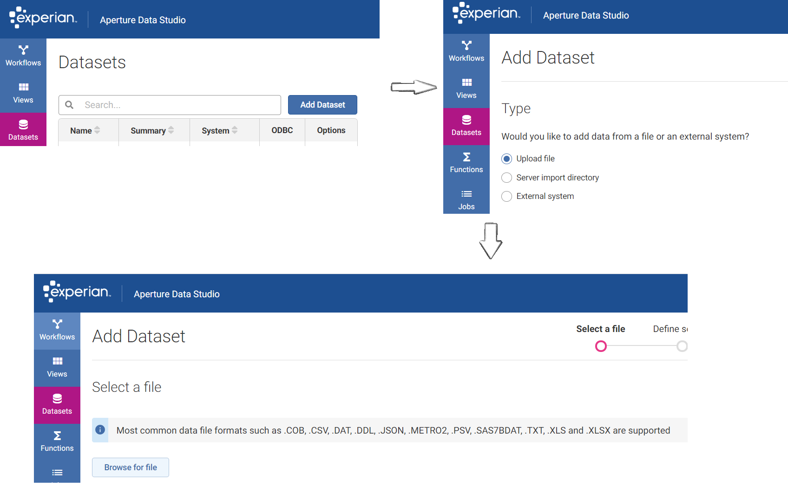
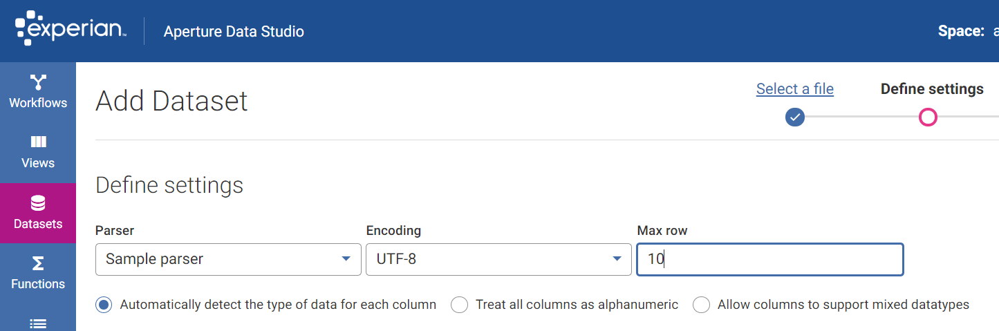
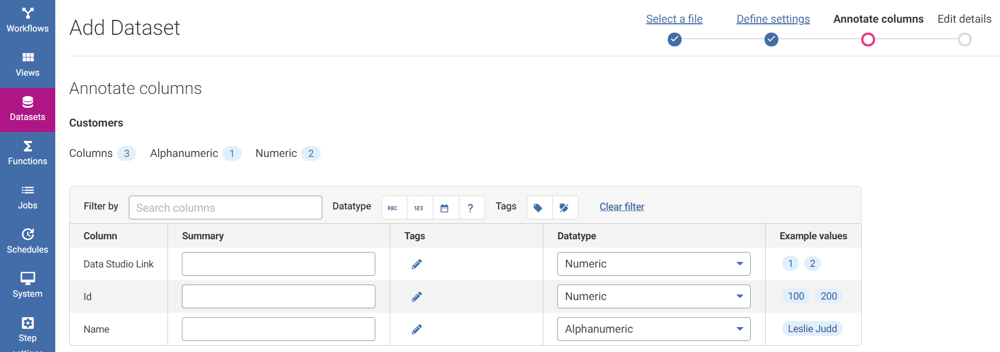
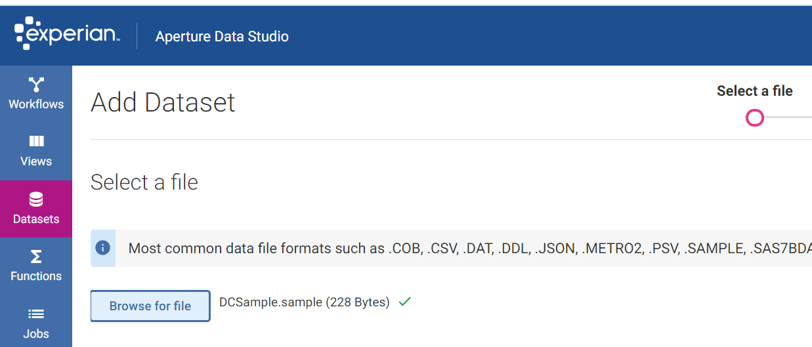

# SDK Test Framework

Apart from providing all the resources you need to develop custom steps and parsers, the SDK also contains a test framework that can help you test custom steps and parsers at component level. The test framework uses JUnit.

The test framework helps mock the behavior of Data Studio where a custom step and parser are installed. This ensures both custom step and parser works as intended. The test framework is also useful for creating regression tests.

**Purpose:** The SDK test framework is a standalone environment that mimics Aperture Data Studio to test the custom steps and parsers built by developers to ensure they work as designed. 

The SDK test framework is not a complete duplicate of the Aperture Data Studio environment but only a limited simulation without the full features of Data Studio. However it provides sufficient resources to ensure a custom step and parser are compatible with an actual Data Studio environment and should run as intended. 

This project provides instructions on how to test an *individual* custom step and parser jar. 

Example custom step tested is: 
- [AddVAT](#custom-step-test-framework-configuration)

Example custom parser tested is:
- [JsonParser](#custom-parser-test-framework-configuration)

# Custom Step Test Framework Configuration

The SDK Test Framework tests are run using [JUnit](https://junit.org/) (a user interface is not provided). For more details about JUnit, refer to the [user documentation](https://junit.org/).

The steps to test a custom step using the SDK Test Framework can be roughly simplified over the following steps: 
1. [Writing a Test using the SDK Test Framework](#writing-a-test-using-the-sdk-test-framework)
2. [Running the Test](#running-the-test)

## Writing a Test using the SDK Test Framework

**Assumption:** The developer has already written a custom step to be tested using this framework.  

In this example, we will use the AddVAT example step for the demonstration. For further details about the AddVAT example step, refer to the source code. 

A test consists of the following: 

1. Defining the test parameters (through the methods prescribed in SDKTestFramework.java): 
    - [Test Setting](#test-setting) - [Test Setting Example](#test-setting-example)
    - [Test Step](#test-step) - [Test Step Example](#test-step-example)
    - [Test Data Source](#test-data-source) - [Test Data Source Example](#test-data-source-example)

2. [Building the test suite](#building-the-test-suite) with the parameters above (producing a TestSuite.java object)

3. [Executing the test suite](#executing-the-test-suite) to produce a TestResult.java object. 

4. [Asserting the expected results](#asserting-the-expected-results) on the TestResult.java object. 


In detail, the defining of test parameters use the following methods of the SDKTestFramework.java class: 
- `createTestSetting()`
- `createTestStep()`
- `createTestDataSource()`

#### Test Setting
The `createTestSetting()` method of SDKTestFramework.java class takes a TestSettingBuilder (which returns a TestSetting.java object) as an argument. 

The TestSettingBuilder allows you to configure the settings for the test using the following methods (all except build() are optional): 
- `setStepSetting()` 
- `populateCaches()`
- `setProgress()`
- `setIsInteractive()`
- `build()` - returns a TestSetting.java object

#### Test Step
The `createTestStep()` method of SDKTestFramework.java class takes a TestStepBuilder (which returns a TestStep.java object) as an argument. 

The TestStepBuilder allows you to configure the custom step for the test using the following methods: 
- `loadCustomStep()` 
- `withPropertyValue()`
- `withMockResources()` - optional
- `build()` - returns a TestStep.java object

#### Test Data Source
The `createTestDataSource()` method of SDKTestFramework.java class takes a DataSourcesBuilder (which returns a list of DataSource.java objects) as an argument. 

The DataSourcesBuilder allows you to configure the data sources for the test using the following methods: 
- `addDataSource()` - optional
- `build()` - returns a list of DataSource.java objects

### Demo: AddVAT Step Test 

An example workflow with the AddVAT Step in Data Studio would look similar to the following: 


To reiterate, the SDK Test Framework is designed to replicate the above functionality of Data Studio (with only limited features) to test a custom step. Using AddVATTest.java as an example, the Java class can be found at: `/aperture-data-studio-sdk/SDKTestFramework/src/test/java/com/experian/datastudio/sdk/testframework/sample/`

#### Test Setting Example: 

```
TestSetting setting = SDKTestFramework.createTestSetting(testSettingCreator());

...

private static Function<TestSettingBuilder, TestSetting> testSettingCreator() {
    return testSettingBuilder -> testSettingBuilder
            .setStepSetting("setting-1", "Test") //Set step setting field
            .build();
}
```

This essentially replicates the Step Settings for the AddVAT step in Data Studio as below: 


#### Test Step Example: 

```
TestStep step = SDKTestFramework.createTestStep(testStepCreator());

...

private static Function<TestStepBuilder, TestStep> testStepCreator(){
    return testStepBuilder -> testStepBuilder
            .loadCustomStep(CustomStepLoader -> CustomStepLoader
                    .fromStepDefinition(new AddVAT()))
            .withPropertyValue(StepPropertiesValueBuilder -> StepPropertiesValueBuilder
                    .setColumnChooserStepPropertyValue("ColumnChooser", Collections.singletonList(0))
                    .setNumberStepPropertyValue("vat-rate", 17.5)
                    .build())
            .build();
}
```

This essentially replicates the AddVAT step to be tested in Data Studio as below (the first column is selected for the Column Chooser): 


#### Test Data Source Example: 

```
List<DataSource> sources = SDKTestFramework.createTestDataSource(dataSourceCreator());

...

private static Function<DataSourcesBuilder, List<DataSource>> dataSourceCreator(){
    return dataSourcesBuilder ->
            dataSourcesBuilder
                    .addDataSource(datasource -> datasource
                            .createNewSource("Column1", "Column2", "Column3")
                            .connectToInputNodeIds("input-1")
                            .addRow(1, 11, 111)
                            .addRow(2, 22, 222)
                            .addRow(3, 33, 333)
                            .build())
                    .build();
}
```

This essentially replicates the data source to the test step in Data Studio as below: 


**Note:** There is an option to load a CSV file as a datasource using the loadCSV() method when defining the function argument for addDataSource() instead of the createNewSource() method as demonstrated above. 

### Building the Test Suite

With [test settings](#test-setting-example), [test step](#test-step-example), and [test data source](#test-data-source-example) defined as above, build the Test Suite using the builder as follows: 

```
TestSuite testSuite = TestSuite
                .builder()
                .withTestSetting(setting)
                .withDataSource(sources)
                .withTestStep(step)
                .build();
```

### Executing the Test Suite

Executing the test suite is relatively simple using the `executeTest()` method of the TestSuite class. This returns a TestResult object on which assertions can be made. 

```
TestResult result = testSuite.executeTest(OUTPUT_ID);
```

### Asserting the Expected Results

Assert the expected results uses the Assert class methods from [JUnit](https://junit.org/). The actual results after executing the code can be retrieved from the TestResult object produced by the execution of the Test Suite as shown above.  

```
Assertions.assertEquals(3, result.getRowCount());
Assertions.assertEquals(1.175, result.getValueAt(0,0).getValue());
Assertions.assertEquals(2.35, result.getValueAt(0,1).getValue());
Assertions.assertEquals(3.525, result.getValueAt(0,2).getValue());
Assertions.assertEquals(11, ((Number) result.getValueAt("Column2", 0).getValue()).intValue());
```

## Running the Test

With the test written (following the [Writing a Test using the SDK Test Framework](#writing-a-test-using-the-sdk-test-framework) section), the Test needs to be built and run using Gradle. 

1. Run `gradle build` either from the command line or from IntelliJ IDEA:

    

2. Navigate to the test written with the SDK Test Framework (e.g. AddVATTest.java). 

    
   
3. Right click the Java file of the test (e.g. AddVATTest.java) and click "Run '\<Test Name\>'" (e.g. "Run 'AddVATTest'"). 

    

    OR 

    


4. The output of the test will be displayed as below:

    

# Custom Parser Test Framework Configuration

The steps to test a custom step using the SDK Test Framework can be roughly simplified over the following steps: 
1. [Writing a Test using the SDK Test Framework](#writing-a-test-using-the-sdk-test-framework)
2. [Running the Test](#running-the-test)

## Writing a Test using the SDK Test Framework

In this example, we will use the Metro2 parser for the demonstration. For further details about the Metro2 parser, refer to the source code. 

A test consists of the following: 

1. Defining the test parameters (through the methods prescribed in SDKTestFramework.java): 
	- [Pasrser Loader](#parser-loader) - [Parser Test Loader Example](#parser-test-loader-example)
    - [Parser Test Setting](#parser-test-setting) - [Parser Test Setting Example](#parser-test-setting-example)
    - [Parser Test Data Source](#parser-test-data-source) - [Parser Test Data Source Example](#parser-test-data-source-example)

2. [Building the parser test suite](#building-the-parser-test-suite) with the parameters above (producing a ParserTestSuite.java object)

3. [Executing the parser test suite](#executing-the-test-suite) to produce a ParserTestResult.java object. 

4. [Asserting the parser expected results](#asserting-the-parser-expected-results) on the ParserTestResult.java object. 


In detail, the defining of test parameters use the following methods of the SDKTestFramework.java class: 
- `createTestParser()`
- `createTestParserSetting()`
- `createTestParserSource()`

#### Parser Loader
The `createTestParser()` method of SDKTestFramework.java class takes a TestParserBuilder (which returns a list of TestParser.java objects) as an argument. 

The TestParserBuilder allows you to configure the parser for the test using the following methods: 
- `loadCustomParser()` 
- `addParserParameter()`
- `build()` - returns a list of TestParser.java object

#### Parser Test Setting
The `createTestParserSetting()` method of SDKTestFramework.java class takes a ParserSettingBuilder (which returns a TestParserSetting.java object) as an argument. 

The ParserSettingBuilder allows you to configure the settings for the test using the following methods: 
- `assignDataTypeToColumn()` - optional 
- `build()` - returns a TestParserSetting.java object

#### Parser Test Data Source
The `createTestParserSource()` method of SDKTestFramework.java class takes a TestParserSourceBuilder (which returns a list of TestParserSource.java objects) as an argument. 

The TestParserSourceBuilder allows you to configure the data sources for the test using the following methods: 
- `loadFile()` - optional
- `loadStream()` - optional
- `build()` - returns a list of TestParserSource.java objects

### Demo: Json Parser Test 

An example of uploading json file using Json Parser in Data Studio would look similar to the following: 



To reiterate, the SDK Test Framework is designed to replicate the above functionality of Data Studio (with only limited features) to test a custom parser. Using JsonParserTfwTest.java as an example, the Java class can be found at: `/aperture-data-studio-sdk/SDKTestFramework/src/test/java/com/experian/datastudio/sdk/parser/json/`

#### Parser Test Loader Example:

```
final TestParser parser = SDKTestFramework.createTestParser(
                parserBuilder -> parserBuilder
                        .loadCustomParser(customParserLoader ->
                                customParserLoader.fromParserDefinition(new JsonParser()))
                        .addParserParameter("&header_processing_iteration", 3L)
                        .addParserParameter("&id_field", "Id")
                        .build());
```
						
This essentially replicates the loading of json file into Data Studio as below:



#### Parser Test Setting Example: 

```
final TestParserSetting setting = SDKTestFramework.createTestParserSetting(
                parserSettingBuilder -> parserSettingBuilder
                        .assignDataTypeToColumn(ParserDataType.NUMERIC, "Data Studio Link")
						.assignDataTypeToColumn(ParserDataType.NUMERIC, "Id")
						.assignDataTypeToColumn(ParserDataType.ALPHANUMERIC, "Name")
                        .build()
        );
}
```

This essentially replicates the column annotation for the Json parser in Data Studio as below: 



#### Parser Test Data Source Example: 

```
final TestParserSource source = SDKTestFramework.createTestParserSource(
                parserSourceBuilder -> parserSourceBuilder
                        .loadFile("/json/example.json")
                        .build());
```

This essentially replicates the data source uploaded into Data Studio as below: 



### Building the parser test suite

With [parser test loader](#parser-test-loader-example), [parser test setting](#parser-test-setting-example), and [parser test data source](#parser-test-data-source-example) defined as above, build the Test Suite using the builder as follows: 

```
final ParserTestSuite testSuite = ParserTestSuiteBuilderFactory.newBuilder()
                .withParser(parser)
                .withSource(source)
				.withSetting(setting)
                .build();
```

### Executing the parser test suite

Executing the parser test suite is relatively simple using the `execute()` method of the ParserTestSuite class. This returns a ParserTestResult object on which assertions can be made. 

```
final ParserTestResult result = testSuite.execute();
```

### Asserting the parser expected results

Assert the expected results uses the Assert class methods from [JUnit](https://junit.org/). The actual results after executing the code can be retrieved from the ParserTestResult object produced by the execution of the Test Suite as shown above.  

```
assertThat(result.getTableDefinitions().size()).isEqualTo(1);
assertThat(result.getTableDefinitionById("Customers")).isNotNull();
```

Alternatively, you can use TableResultAssert which bundled together with SDK TestFramework.

```
TableResultAssert.assertThat(result.getTableResult("Customers")).compareOutputWithCsv("/json/example-customer-result.csv");
```
