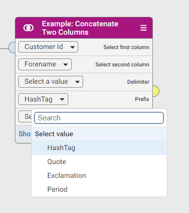

# Best practices and limitation for custom steps

## Best practices

### One custom step per jar
It is recommended that you bundle one custom step per JAR.

### Fat jar
Bundle the custom step in a fat jar where all dependencies are bundled into a single jar. For more details, [read this](README.md#class-isolation).

### Progress bar handling
Please take note that `progressChanged()` must not be called inside `outputColumnManager.onValue()`. [See example.](README.md#Progress-bar-handling)

### Use provided HTTP client library
It is recommended to use the provided HTTP client library to access external endpoints through the HTTP protocol.  [See example.](README.md#The-HTTP-Client-library)

### Use provided Logger
It is also recommended to use the provided `Logger` to write custom step logs.  [See example.](README.md#The-Logging-library) Custom step logs can be retrieve from C:\ApertureDataStudio\data\log

## Limitation
### Both custom chooser and column chooser cannot be reset
Once the value for the custom chooser or column chooser is selected, it cannot be reset to its initial state anymore. For example, once hash tag is selected for the prefix custom chooser, prefix custom chooser cannot be reset to display "Select a value".

### Single output node
Currently the custom step only supports single output node, as you can assign the result of the custom step to only *one* output node.

### Cannot add column during processing step
No new column can be added in the `StepProcessor`, column can only be added in the `StepConfiguration`.

### Not able to tag output column
Adding tags to output column is not supported.
